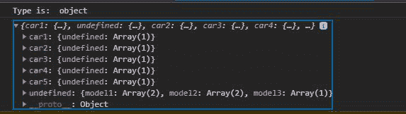
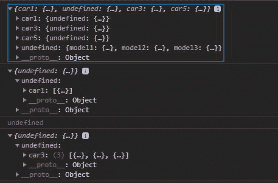

# D3.js nest.object()函数

> 原文:[https://www.geeksforgeeks.org/d3-js-nest-object-function/](https://www.geeksforgeeks.org/d3-js-nest-object-function/)

D3.js 中的 **nest.object()** 函数用于对给定数组应用 nest 运算符，并返回键值对的嵌套对象。

**语法:**

```
nest.object( array )
```

**参数:**该功能接受如上所述的单个参数，描述如下:

*   **数组:**此参数保存对象的数组。

**返回值:**返回对象。

以下是上述功能的几个示例

**例 1:** 当不存在重复键时。

## 超文本标记语言

```
<!DOCTYPE html>
<html lang="en">

<head>
    <meta charset="UTF-8">
    <meta name="viewport" content=
        "width=device-width, initial-scale=1.0">

    <style>
        .originalColor {
            height: 100px;
            width: 100px;
        }

        .darkerColor {
            height: 100px;
            width: 100px;
        }
    </style>
</head>

<body>

    <!-- Fetching from CDN of D3.js -->
    <script type="text/javascript" 
        src="https://d3js.org/d3.v4.min.js">
    </script>

    <script>
        // Forming the array of objects
        let array = [
            { car: "car1" }, { model: "model1" },
            { car: "car2" }, { model: "model1" },
            { car: "car3" }, { model: "model2" },
            { car: "car4" }, { model: "model2" },
            { car: "car5" }, { model: "model3" }
        ]
        let data = d3.nest()
            .key(function (d) { return d.car; })
            .key(function (d) { return d.model; })
            .object(array)
        console.log("Type is: ", typeof array)
        console.log(data);
    </script>
</body>

</html>
```

**输出:**



**示例 2:** 当存在重复的键并且访问那些在访问时不存在的键时，输出未定义。

## 超文本标记语言

```
<!DOCTYPE html>
<html lang="en">

<head>
    <meta charset="UTF-8">
    <meta name="viewport" content=
        "width=device-width, initial-scale=1.0">

    <style>
        .originalColor {
            height: 100px;
            width: 100px;
        }

        .darkerColor {
            height: 100px;
            width: 100px;
        }
    </style>
</head>

<body>
    <!-- Fetching from CDN of D3.js -->
    <script type="text/javascript" 
        src="https://d3js.org/d3.v4.min.js">
    </script>

    <script>
        // Forming the array of objects
        let array = [
            { car: "car1" }, { model: "model1" },
            { car: "car3" }, { model: "model1" },
            { car: "car3" }, { model: "model2" },
            { car: "car3" }, { model: "model2" },
            { car: "car5" }, { model: "model3" }
        ]
        let data = d3.nest()
            .key(function (d) { return d.car; })
            .key(function (d) { return d.model; })
            .key(function (d) { return d.car; })
            .object(array)
        console.log(data);
        console.log(data.car1);

        // Key does not exists so 
        // output is undefined
        console.log(data.car2);
        console.log(data.car3);
    </script>
</body>

</html>
```

**输出:**

