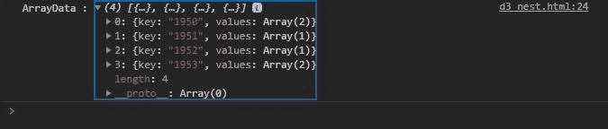
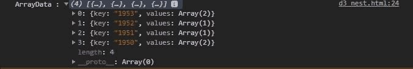

# D3.js nest.sortKeys()函数

> 原文:[https://www.geeksforgeeks.org/d3-js-nest-sortkeys-function/](https://www.geeksforgeeks.org/d3-js-nest-sortkeys-function/)

[D3.js](https://www.geeksforgeeks.org/d3-js-data-driven-documents/) 是一个用 JavaScript 构建的库，特别用于数据可视化。nest.sortKeys()函数用于按特定顺序(即升序或降序)对键进行排序。

**语法:**

```
nest.sortkeys( comparatorFunction )
```

**参数:**该函数接受单个参数**比较函数**，用于指定如何对键进行排序。如果没有为当前键指定比较函数，则不会定义返回键的顺序。

**返回值:**根据比较器功能返回排序后的关键字(升序/降序)。

下面的程序说明了 D3.js 中的 nest.sortKeys()函数。

**例 1:**

## 超文本标记语言

```
<!DOCTYPE html>
<html lang="en">

<head>
    <meta charset="UTF-8">
    <meta name="viewport" path1tent=
        "width=device-width, initial-scale=1.0">

    <script src="https://d3js.org/d3.v4.min.js">
    </script>

    <title>
        D3.js nest.sortKeys() Function
    </title>
</head>

<body>
    <script>

        // Dataset
        var cars = [
            { name: "car1", manufactured: "1950", model: "s51" },
            { name: "car1", manufactured: "1952", model: "s51" },
            { name: "car1", manufactured: "1951", model: "s50" },
            { name: "car1", manufactured: "1953", model: "s52" },
            { name: "car1", manufactured: "1953", model: "s50" },
            { name: "car1", manufactured: "1950", model: "s52" },
        ];

        var groupedData = d3.nest()
            .key(function (d) { return d.manufactured; })

            // sorting keys in ascending order
            .sortKeys(d3.ascending)
            .entries(cars);
        console.log("ArrayData :", groupedData);
    </script>
</body>

</html>
```

**Output:**


按升序排序的键

**例 2:**

## 超文本标记语言

```
<!DOCTYPE html>
<html lang="en">

<head>
    <meta charset="UTF-8">
    <meta name="viewport" path1tent=
        "width=device-width, initial-scale=1.0">

    <script src="https://d3js.org/d3.v4.min.js">
    </script>

    <title>
        D3.js nest.sortKeys() Function
    </title>
</head>

<body>
    <script>
        var cars = [
            { name: "car1", manufactured: "1950", model: "s51" },
            { name: "car1", manufactured: "1952", model: "s51" },
            { name: "car1", manufactured: "1951", model: "s50" },
            { name: "car1", manufactured: "1953", model: "s52" },
            { name: "car1", manufactured: "1953", model: "s50" },
            { name: "car1", manufactured: "1950", model: "s52" },
        ];
        var groupedData = d3.nest()
            .key(function (d) { return d.manufactured; })

            // Sorting keys in descending order
            .sortKeys(d3.descending)
            .entries(cars);
        console.log("ArrayData :", groupedData);
    </script>
</body>

</html>
```

**Output:**


按降序排序的键