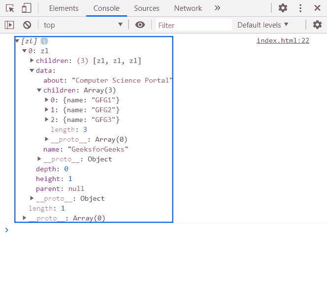
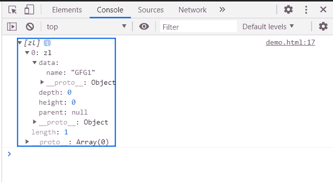

# D3.js 节点.祖先()功能

> 原文:[https://www . geesforgeks . org/D3-js-node-predens-function/](https://www.geeksforgeeks.org/d3-js-node-ancestors-function/)

函数 r 返回一个祖先节点数组，从给定的节点开始，然后是每个父节点直到根节点。

**语法:**

```
node.ancestors();

```

**参数:**该方法不取参数。

**返回值:**此方法返回 一组祖先节点 。

**例 1:**

## 超文本标记语言

```
<!DOCTYPE html>
<html>
<head>
    <meta charset="utf-8">

    <script src=
        "https://d3js.org/d3.v5.min.js">
    </script>
</head>

<body>
    <script>
        var data = {
            "name":"GeeksforGeeks", 
            "about":"Computer Science Portal",
            "children":[
                {"name":"GFG1"},
                {"name":"GFG2"},
                {"name":"GFG3"}
            ]
        }
        var root = d3.hierarchy(data);
        a=root.ancestors();
        console.log(a);
    </script>
</body>

</html>
```

**输出:**



**例 2:**

## 超文本标记语言

```
<!DOCTYPE html>
<html>
<head>
    <meta charset="utf-8">

    <script src=
        "https://d3js.org/d3.v5.min.js">
    </script>
</head>

<body>
    <script>
        var data = {"name":"GFG1"}

        var root = d3.hierarchy(data);

        console.log(root.ancestors());
    </script>
</body>

</html>
```

**输出:**

