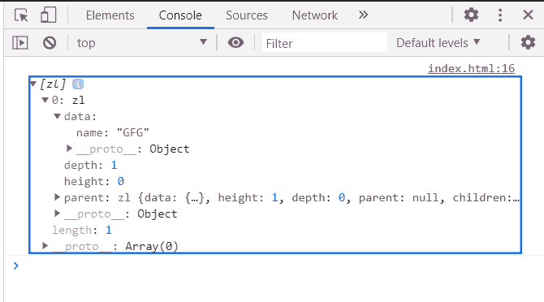
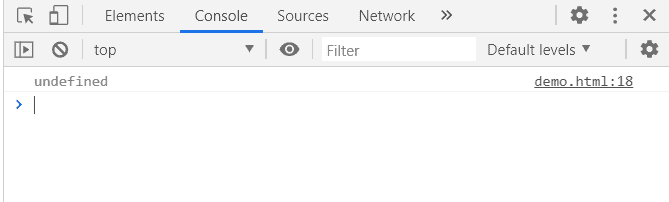

# D3.js 节点.子属性

> 原文:[https://www.geeksforgeeks.org/d3-js-node-children-property/](https://www.geeksforgeeks.org/d3-js-node-children-property/)

D3.js 中的 **node.children 属性**返回一个子节点数组(叶节点为空，没有子节点的节点未定义)。

**语法:**

```
node.children
```

**返回值:**该属性返回一个子节点数组(叶节点为空，没有子节点的节点未定义)。

**例 1:**

## 超文本标记语言

```
<!DOCTYPE html>
<html>
<head>
    <meta charset="utf-8">

    <script src=
        "https://d3js.org/d3.v5.min.js">
    </script>
</head>

<body>
    <script>
        var data = {
            "name":"GeeksforGeeks", 
            "about":"Computer Science Portal",
            "children":[{"name":"GFG"}]
        }
        var root = d3.hierarchy(data);
        console.log(root.children);
    </script>
</body>

</html>
```

**输出:**



**示例 2:** 在本例中，由于根节点没有子节点，因此该方法返回 undefined。

## 超文本标记语言

```
<!DOCTYPE html>
<html>

<head>
    <meta charset="utf-8">

    <script src=
        "https://d3js.org/d3.v5.min.js">
    </script>
</head>

<body>
    <script>
        var data = {"name":"GFG1"}

        var root = d3.hierarchy(data);

        console.log(root.children);
    </script>
</body>

</html>
```

**输出:**

