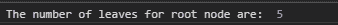

# D3.js node.count()函数

> 原文:[https://www.geeksforgeeks.org/d3-js-node-count-function/](https://www.geeksforgeeks.org/d3-js-node-count-function/)

**D3.js** 库的 **node.count()** 函数用于统计特定节点下的叶子数量，并将其作为值属性追加到对象中。如果给定的节点本身是叶节点，则计数为 1。

**语法:**

```
node.count();
```

**参数:**该函数不取任何参数。

**返回值:**该函数返回一个对象。

下面是上面给出的函数的几个例子。

**示例 1:** 以下示例演示了计算根节点的叶子。

## 超文本标记语言

```
<!DOCTYPE html>
<html lang="en">

<head>
    <meta charset="UTF-8" />
    <meta name="viewport" path1tent=
    "width=device-width, initial-scale = 1.0" />

    <script src="https://d3js.org/d3.v4.min.js">
    </script>
</head>

<body>
    <script>
        // Constructing a tree
        var tree = {
            name: "rootNode",
            children: [
                {
                    name: "child1"
                },
                {
                    name: "child2",
                    children: [
                        {
                            name: "grandchild1",
                            children: [
                                { name: "grand_granchild1_1" },
                                { name: "grand_granchild1_2" }
                            ]
                        },
                        {
                            name: "grandchild2",
                            children: [
                                { name: "grand_granchild2_1" },
                                { name: "grand_granchild2_2" }
                            ]
                        },
                    ]
                }
            ]
        };

        var obj = d3.hierarchy(tree);

        // Using node.count() Function
        var count = obj.count();
        console.log("The number of leaves for root"
                + " node are: ", count.value);
    </script>
</body>

</html>
```

**输出:**



**示例 2:** 下面的代码演示了计算任意节点的叶子数量。

## 超文本标记语言

```
<!DOCTYPE html>
<html lang="en">

<head>
    <meta charset="UTF-8" />
    <meta name="viewport" path1tent=
        "width=device-width, initial-scale = 1.0" />
    <script src="https://d3js.org/d3.v4.min.js">
    </script>
</head>

<body>
    <script>
        // Constructing a tree
        var tree = {
            name: "rootNode", // Root node
            children: [
                {
                    name: "child1" // Child of root node
                },
                {
                    name: "child2", // Child of root node
                    children: [
                        {
                            // Child of child2
                            name: "grandchild1",
                            children: [
                                // Child of grandchild1
                                { name: "grand_granchild1_1" },
                                // Child of grandchild1 
                                { name: "grand_granchild1_2" }
                            ]
                        },
                        {
                            name: "grandchild2",
                            children: [
                                // Child of grandchild2
                                { name: "grand_granchild2_1" },
                                // Child of grandchild2
                                { name: "grand_granchild2_2" }
                            ]
                        },
                    ]
                }
            ]
        };

        var obj = d3.hierarchy(tree);
        var grandchild2 = obj.children[1].children[1];

        // Using node.count() function
        var count = grandchild2.count();
        console.log("The number of leaves for "
            + "grandchild2 are: ", count.value);
    </script>
</body>

</html>
```

**输出:**

