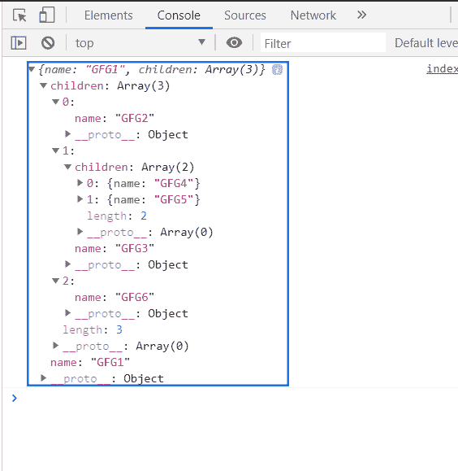
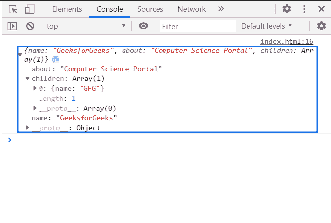

# D3.js 节点.数据属性

> 原文:[https://www.geeksforgeeks.org/d3-js-node-data-property/](https://www.geeksforgeeks.org/d3-js-node-data-property/)

**D3.js node.data** 属性从为其创建了 层次结构 节点的数据源返回原始对象。

**语法:**

```
node.data 

```

**返回值:**该属性从为其创建了 层次结构 节点的数据源中返回原始对象。

**示例 1:** 从层次节点获取数据对象。

## 超文本标记语言

```
<!DOCTYPE html>
<html>
<head>
    <meta charset="utf-8">

    <script src=
        "https://d3js.org/d3.v5.min.js">
    </script>
</head>

<body>
    <script>
       var data = {"name":"GFG1", "children":[
                      {"name":"GFG2", },
                      {"name":"GFG3", "children":[
                          {"name":"GFG4"},
                          {"name":"GFG5"}]},
                      {"name":"GFG6"}]};

        var root = d3.hierarchy(data);
        console.log(root.data)
    </script>
</body>

</html>
```

**输出:**



**例 2:**

## 超文本标记语言

```
<!DOCTYPE html>
<html>
<head>
    <meta charset="utf-8">

    <script src=
        "https://d3js.org/d3.v5.min.js">
    </script>
</head>

<body>
    <script>
       var data = {
            "name":"GeeksforGeeks", 
            "about":"Computer Science Portal",
            "children":[{"name":"GFG"}]
          }
        var root = d3.hierarchy(data);
        console.log(root.data)
    </script>
</body>

</html>
```

**输出:**

