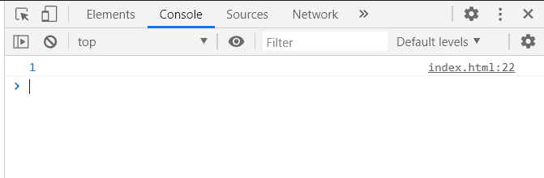
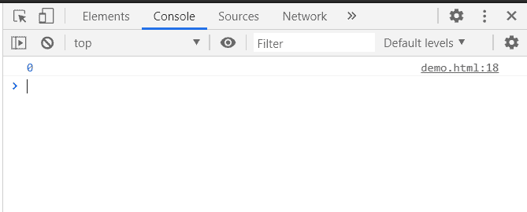

# D3.js 节点.深度属性

> 原文:[https://www.geeksforgeeks.org/d3-js-node-depth-property/](https://www.geeksforgeeks.org/d3-js-node-depth-property/)

**D3.js node.depth 属性**返回从节点到根的路径长度。

**语法:**

```
node.depth

```

**返回值:**该属性返回从节点到根的路径长度。

**例 1:**

## 超文本标记语言

```
<!DOCTYPE html>
<html>
<head>
    <meta charset="utf-8">

    <script src=
        "https://d3js.org/d3.v5.min.js">
    </script>
</head>

<body>
    <script>
        var data = {
            "name":"GeeksforGeeks", 
            "about":"Computer Science Portal",
            "children":[
                {"name":"GFG1"},
                {"name":"GFG2"},
                {"name":"GFG3"},
                {"name":"GFG4"}
            ]
        }
        var root = d3.hierarchy(data);
        console.log(root.children[0].depth);
    </script>
</body>

</html>
```

**输出:**



**示例 2:** 在本例中，由于根节点没有子节点，因此该方法返回 undefined。

## 超文本标记语言

```
<!DOCTYPE html>
<html>
<head>
    <meta charset="utf-8">

    <script src=
        "https://d3js.org/d3.v5.min.js">
    </script>
</head>

<body>
    <script>
        var data = {"name":"GFG1"}

        var root = d3.hierarchy(data);

        console.log(root.depth);
    </script>
</body>

</html>
```

**输出:**

