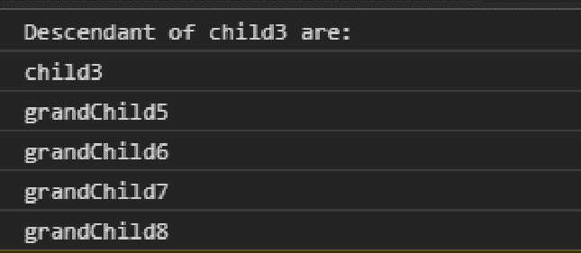
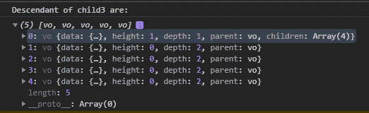

# D3.js 节点.后代()函数

> 原文:[https://www . geesforgeks . org/D3-js-node-后代-function/](https://www.geeksforgeeks.org/d3-js-node-descendants-function/)

**d3.js** 库中的**节点.后代()**函数用于生成并返回一个后代节点数组。

**语法:**

```
node.descendants();
```

**参数:**此功能不接受任何参数。

**返回值:**这个函数返回一个数组。

下面是上面给出的函数的几个例子。

**例 1:**

## 超文本标记语言

```
<!DOCTYPE html>
<html lang="en">

<head>
    <meta charset="UTF-8" />
    <meta name="viewport" path1tent=
        "width=device-width, initial-scale = 1.0"/>
    <script src="https://d3js.org/d3.v4.min.js">
    </script>
</head>

<body>
    <script>
        var obj = d3.hierarchy({
            name: "rootNode",
            children: [
                {
                    name: "child1"
                },
                {
                    name: "child2",
                    children: [
                        { name: "grandChild1" },
                    ]
                },
                {
                    name: "child3",
                    children: [
                        { name: "grandChild5" },
                        { name: "grandChild6" },
                        { name: "grandChild7" },
                        { name: "grandChild8" },
                    ]
                }
            ]
        });
        // Descendant of child3
        console.log("Descendant of child3 are: ");
        console.log(obj.children[2]
            .descendants()[0].data.name);

        console.log(obj.children[2]
            .descendants()[1].data.name);

        console.log(obj.children[2]
            .descendants()[2].data.name);

        console.log(obj.children[2]
            .descendants()[3].data.name);

        console.log(obj.children[2]
            .descendants()[4].data.name);
    </script>
</body>

</html>
```

**输出:**



**例 2:**

## 超文本标记语言

```
<!DOCTYPE html>
<html lang="en">

<head>
    <meta charset="UTF-8" />
    <meta name="viewport" path1tent=
        "width=device-width, initial-scale = 1.0"/>
    <script src="https://d3js.org/d3.v4.min.js">
    </script>
</head>

<body>
    <script>
        var obj = d3.hierarchy({
            name: "rootNode",
            children: [
                {
                    name: "child1"
                },
                {
                    name: "child2",
                    children: [
                        { name: "grandChild1" },
                    ]
                },
                {
                    name: "child3",
                    children: [
                        { name: "grandChild5" },
                        { name: "grandChild6" },
                        { name: "grandChild7" },
                        { name: "grandChild8" },
                    ]
                }
            ]
        });

        // Descendant of child3
        console.log("Descendant of child3 are: ");
        console.log(obj.children[2].descendants());
    </script>
</body>

</html>
```

**输出:**

