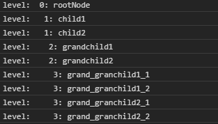
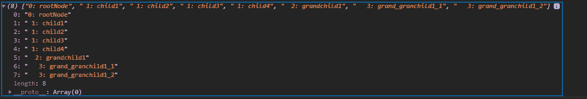

# D3 . js . node . each()函数

> 原文:[https://www.geeksforgeeks.org/d3-js-node-each-function/](https://www.geeksforgeeks.org/d3-js-node-each-function/)

**节点.每个()**函数用于评估宽度一阶中每个节点的函数。在这种情况下，每个节点只被访问一次。对每个后代节点重复调用该函数。

**语法:**

```
node.each(function);
```

**参数:**该函数接受如上所述的单个参数，如下所述:

*   **函数:**这需要在 BFS 顺序中的每个节点上调用一个函数。

**返回值:**这个函数不返回任何东西。

**例 1:**

## 超文本标记语言

```
<!DOCTYPE html> 
<html lang = "en"> 

<head> 
    <meta charset = "UTF-8" /> 
    <meta name = "viewport"
          path1tent = "width=device-width, 
          initial-scale = 1.0"/> 

    <script src =
        "https://d3js.org/d3.v4.min.js">
    </script>
</head> 

<body> 
    <script> 
    // Constructing a tree
    var tree={
            name: "rootNode",
            children: [
                {
                    name: "child1"
                },
                {
                    name: "child2",
                    children: [
                        {
                            name: "grandchild1",
                            children:[
                                {
                                    name: "grand_granchild1_1"
                                },
                                {
                                    name: "grand_granchild1_2"
                                }
                            ]
                        },
                        {
                            name: "grandchild2",
                            children:[
                                {
                                    name: "grand_granchild2_1"
                                },
                                {
                                    name: "grand_granchild2_2"
                                }
                            ]
                        },
                    ]
                }
            ]
        };

        var obj = d3.hierarchy(tree);

        const BFS = [];

        // Function is used
        obj.each(d => BFS.push(
            " ".repeat(d.depth) + `${d.depth}: ${d.data.name}`
            ));

        BFS.forEach((e)=>{
            console.log("level: ",e);
        });
    </script> 
</body> 

</html>
```

**输出:**



**例 2:**

## 超文本标记语言

```
<!DOCTYPE html> 
<html lang = "en"> 

<head> 
    <meta charset = "UTF-8" /> 
    <meta name = "viewport"
          path1tent = "width=device-width, 
          initial-scale = 1.0"/> 

    <script src =
        "https://d3js.org/d3.v4.min.js">
    </script>
</head> 

<body> 
    <script> 
    // Constructing a tree
    var tree={
            // Level zero
            name: "rootNode",
            children: [
                {
                    // Level one
                    name: "child1"
                },
                {
                    // Level one
                    name: "child2",
                    children: [
                        {
                            // Level two
                            name: "grandchild1",
                            children:[{
                                name: "grand_granchild1_1"
                            },
                            {
                                name: "grand_granchild1_2"
                            }]
                        }
                    ]
                },

                {
                    // Level one
                    name: "child3"
                },
                {
                    // Level one
                    name: "child4"
                }
            ]
        };

        var obj = d3.hierarchy(tree);

        const BFS = [];

        // Function is used
        obj.each(d => BFS.push(
            " ".repeat(d.depth) 
                + `${d.depth}: ${d.data.name}`
        ));

        console.log(BFS);
    </script> 
</body> 

</html>
```

**输出:**

