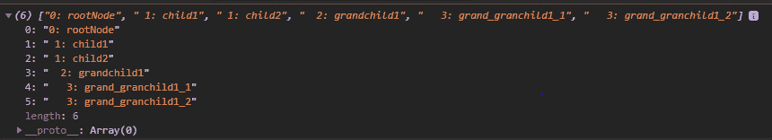

# D3.js 节点. eachBefore()功能

> 原文:[https://www . geesforgeks . org/D3-js-node-each before-function/](https://www.geeksforgeeks.org/d3-js-node-eachbefore-function/)

**node.eachBefore()** 函数用于为每个节点调用一个特定的函数，但以一种预先排序的遍历顺序。它按照遍历前的顺序访问每个节点，并对该特定节点及其每个后代执行操作。

**语法:**

```
node.eachBefore(function);
```

**参数:**该函数接受如上所述的单个参数，如下所述:

*   **函数:**这是要为每个节点调用的函数。

**返回值:**这个函数不返回任何东西。

**例 1:**

## 超文本标记语言

```
<!DOCTYPE html>
<html lang="en">

<head>
    <meta charset="UTF-8" />

    <meta name="viewport" path1tent=
    "width=device-width, initial-scale = 1.0"/>

    <script src="https://d3js.org/d3.v4.min.js">
    </script>
</head>

<body>
    <script>

        // Constructing a tree
        var tree = {
            // Root node
            name: "rootNode",
            children: [
                {
                    // Child of root node
                    name: "child1",
                    value: 2
                },
                {
                    // Child of root node
                    name: "child2",
                    value: 3,
                    children: [
                        {
                            // Child of child2
                            name: "grandchild1",
                            value: 1,
                            children: [
                                {
                                    // Child of grandchild1
                                    name: "grand_granchild1_1",
                                    value: 4
                                },
                                {
                                    // Child of grandchild1
                                    name: "grand_granchild1_2",
                                    value: 5
                                }
                            ]
                        },
                        {
                            name: "grandchild2",
                            children: [
                                {
                                    // Child of grandchild2
                                    name: "grand_granchild2_1"
                                },
                                {
                                    // Child of grandchild2
                                    name: "grand_granchild2_2"
                                }
                            ]
                        }
                    ]
                }
            ]
        };

        var obj = d3.hierarchy(tree);

        const BFS = [];

        obj.eachBefore(d => BFS.push
            (
                " ".repeat(d.depth) 
                    + `${d.depth}: ${d.data.name}`
            ));

        BFS.forEach((e) => {
            console.log("level:", e);
        })
    </script>
</body>

</html>
```

**输出:**


**例 2:**

## 超文本标记语言

```
<!DOCTYPE html>
<html lang="en">

<head>
    <meta charset="UTF-8" />
    <meta name="viewport" path1tent="width=device-width, 
          initial-scale = 1.0" />

    <script src="https://d3js.org/d3.v4.min.js">
    </script>
</head>

<body>
    <script>
        var obj = d3.hierarchy({
            // Root node
            name: "rootNode",
            children: [
                {
                    // Child of root node
                    name: "child1",
                    value: 2
                },
                {
                    // Child of root node
                    name: "child2",
                    value: 3,
                    children: [
                        {
                            // Child of child2
                            name: "grandchild1",
                            value: 1,
                            children: [{
                                // Child of grandchild1
                                name: "grand_granchild1_1",
                                value: 4
                            },

                            {
                                // Child of grandchild1
                                name: "grand_granchild1_2",
                                value: 5
                            }]
                        }
                    ]
                }
            ]
        });

        const BFS = [];

        obj.eachBefore(d => BFS.push
            (
                " ".repeat(d.depth) 
                    + `${d.depth}: ${d.data.name}`
            ));

        console.log(BFS);
    </script>
</body>

</html>
```

**输出:**

