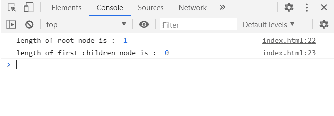

# D3.js 节点.高度属性

> 原文:[https://www.geeksforgeeks.org/d3-js-node-height-property/](https://www.geeksforgeeks.org/d3-js-node-height-property/)

D3.js 中的 **node.height 属性**返回从给定节点到后代叶节点的最大距离。

**语法:**

```
node.height
```

**返回值:**该属性返回从给定节点到后代叶节点的最大距离

**例 1:** 在本例中，对于根节点到叶节点的最大距离为 1，对于叶节点的最大距离为 0。

## 超文本标记语言

```
<!DOCTYPE html>
<html>

<head>
    <meta charset="utf-8">

    <script src=
        "https://d3js.org/d3.v5.min.js">
    </script>
</head>

<body>
    <script>
        var data = {
            "name":"GeeksforGeeks", 
            "about":"Computer Science Portal",
            "children":[
                {"name":"GFG1"},
                {"name":"GFG2"},
                {"name":"GFG3"},
                {"name":"GFG4"}
            ]
        }
        var root = d3.hierarchy(data);
        console.log("Height of root node is : ",
                   root.height);
        console.log("Height of first children node is : ",
                   root.children[0].height);
    </script>
</body>

</html>
```

**输出:**



**示例 2:** 在此示例中，层次结构没有任何子代，因此高度为 0。

## 超文本标记语言

```
<!DOCTYPE html>
<html>
<head>
    <meta charset="utf-8">

    <script src=
        "https://d3js.org/d3.v5.min.js">
    </script>
</head>

<body>
    <script>
        var data = {"name":"GFG1"}

        var root = d3.hierarchy(data);

        console.log("Height of this node is :",
                    root.height);
    </script>
</body>

</html>
```

**输出:**

