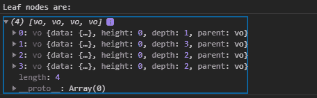
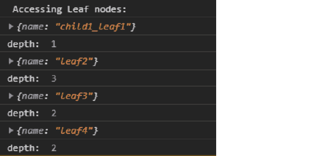

# D3.js 节点. D3.js()函数

> 原文:[https://www.geeksforgeeks.org/d3-js-node-leaves-function/](https://www.geeksforgeeks.org/d3-js-node-leaves-function/)

d3.js 中的**node . leaks()**函数用于按照遍历顺序返回给定层次数据的叶节点数组。

**语法:**

```
node.leaves();
```

**参数:**此功能不接受任何参数。

**返回值:**这个函数返回一个数组。

**注意:**叶节点是那些没有子节点的节点。

下面是上面给出的函数的几个例子。

**例 1:**

## 超文本标记语言

```
<!DOCTYPE html>
<html lang="en">

<head>
    <meta charset="UTF-8" />
    <meta name="viewport" path1tent=
        "width=device-width, initial-scale = 1.0" />
    <script src="https://d3js.org/d3.v4.min.js">
    </script>
</head>

<body>
    <script>
        // Constructing a tree
        var tree = {
            name: "rootNode",
            children: [
                {
                    name: "child1_leaf1"
                },
                {
                    name: "child2",
                    children: [
                        {
                            name: "grandchild1",
                            children: [
                                { name: "leaf2" }
                            ]
                        },
                    ]
                },
                {
                    name: "child3",
                    children: [
                        { name: "leaf3" },
                        { name: "leaf4" },
                    ]
                }
            ]
        };

        var obj = d3.hierarchy(tree);

        // Leaf nodes of the above given tree
        console.log("Leaf nodes are: ");
        console.log(obj.leaves());        
    </script>
</body>

</html>
```

**输出:**



**示例 2:** 下面的代码演示了访问叶节点的数据。

## 超文本标记语言

```
<!DOCTYPE html>
<html lang="en">

<head>
    <meta charset="UTF-8" />
    <meta name="viewport" path1tent=
        "width=device-width, initial-scale = 1.0"/>
    <script src="https://d3js.org/d3.v4.min.js">
    </script>
</head>

<body>
    <script>
        // Constructing a tree
        var tree = {
            name: "rootNode",
            children: [
                {
                    name: "child1_leaf1"
                },
                {
                    name: "child2",
                    children: [
                        {
                            name: "grandchild1",
                            children: [
                                { name: "leaf2" }
                            ]
                        },
                    ]
                },
                {
                    name: "child3",
                    children: [
                        { name: "leaf3" },
                        { name: "leaf4" },
                    ]
                }
            ]
        };

        var obj = d3.hierarchy(tree);

        // Leaf nodes of the above given tree are:
        console.log(" Accessing Leaf nodes: ");
        let leafArr = obj.leaves();
        leafArr.forEach((e) => {
            console.log(e.data);
            console.log("depth: ", e.depth);
        })        
    </script>
</body>

</html>
```

**输出:**

