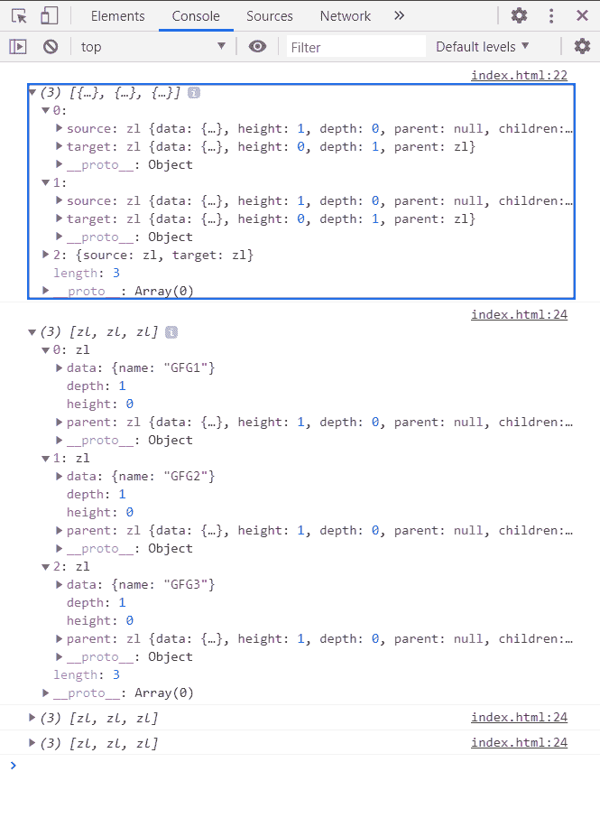
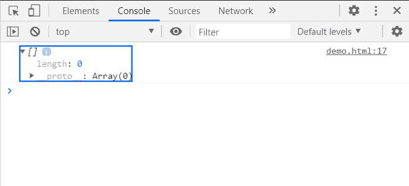

# D3.js 节点. link()功能

> 原文:[https://www.geeksforgeeks.org/d3-js-node-links-function/](https://www.geeksforgeeks.org/d3-js-node-links-function/)

**node.links()** 函数返回一个指向节点对象子节点的链接数组，每个链接对象都有一个源和一个保存子节点引用的目标字段。

**语法:**

```
node.links();
```

**参数:**此方法不接受任何参数。

**返回值:**这个方法返回一个节点对象的子节点的链接数组。

**例 1:**

## 超文本标记语言

```
<!DOCTYPE html>
<html>

<head>
    <meta charset="utf-8">

    <script src=
        "https://d3js.org/d3.v5.min.js">
    </script>
</head>

<body>
    <script>
        var data = {
            "name":"GeeksforGeeks", 
            "about":"Computer Science Portal",
            "children":[
                {"name":"GFG1"},
                {"name":"GFG2"},
                {"name":"GFG3"}
            ]
        }
        var root = d3.hierarchy(data);
        a=root.links();
        console.log(a);
        for (i=0;i<a.length;i++){
            console.log(a[i].source.children)
        }
    </script>
</body>

</html>
```

**输出:**



**示例 2:** 不包含子级的根返回空链接数组。

## 超文本标记语言

```
<!DOCTYPE html>
<html>

<head>
    <meta charset="utf-8">

    <script src=
        "https://d3js.org/d3.v5.min.js">
    </script>
</head>

<body>
    <script>
        var data = {"name":"GFG1"}

        var root = d3.hierarchy(data);

        console.log(root.links());
    </script>
</body>

</html>
```

**输出:**

