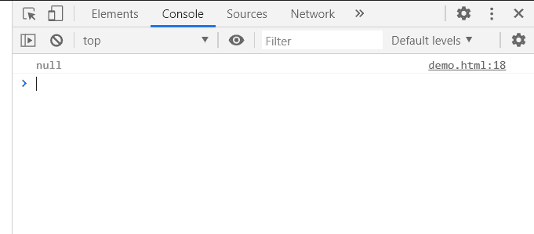
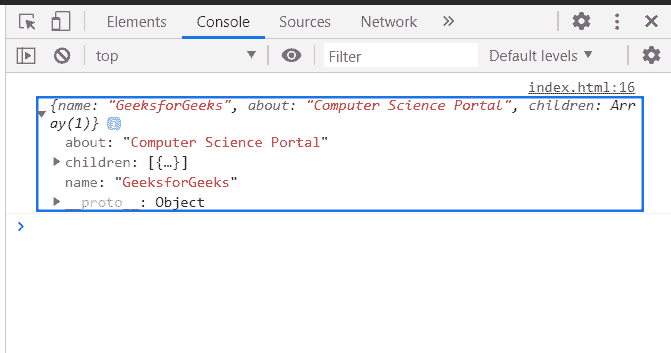

# D3.js 节点.父属性

> 原文:[https://www.geeksforgeeks.org/d3-js-node-parent-property/](https://www.geeksforgeeks.org/d3-js-node-parent-property/)

父属性返回对父节点的引用(根节点为空)

**语法:**

```
node.parent

```

**返回值:**该属性返回对父节点的引用(根节点为空)

**示例 1:** 在本例中，由于根节点，此方法将返回 null。

## 超文本标记语言

```
<!DOCTYPE html>
<html>
<head>
    <meta charset="utf-8">

    <script src=
        "https://d3js.org/d3.v5.min.js">
    </script>
</head>

<body>
    <script>
        var data = {"name":"GFG1"}

        var root = d3.hierarchy(data);

        console.log(root.parent);
    </script>
</body>

</html>
```

**输出:**



**例 2:**

## 超文本标记语言

```
<!DOCTYPE html>
<html>
<head>
    <meta charset="utf-8">

    <script src=
        "https://d3js.org/d3.v5.min.js">
    </script>
</head>

<body>
    <script>
        var data = {
            "name":"GeeksforGeeks", 
            "about":"Computer Science Portal",
            "children":[{"name":"GFG"}]
        }
        var root = d3.hierarchy(data);
        console.log(root.children[0].parent.data);
    </script>
</body>

</html>
```

**输出:**

