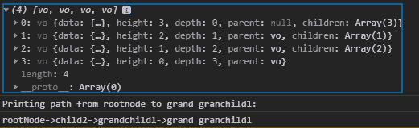
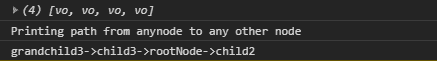

# D3.js 节点. path()函数

> 原文:[https://www.geeksforgeeks.org/d3-js-node-path-function/](https://www.geeksforgeeks.org/d3-js-node-path-function/)

d3.js 中的 **node.path()** 函数用于返回源节点和目的节点之间的最短路径。

**语法:**

```
node.path(target);
```

**参数:**该功能接受如上所述的单个参数，如下所述:

*   **目标:**此参数接受目标节点。

**返回值:**这个函数返回一个数组。

下面是上面给出的函数的几个例子。

**示例 1:** 从根节点到任何其他节点的路径。

## 超文本标记语言

```
<!DOCTYPE html>
<html lang="en">

<head>
    <meta charset="UTF-8" />
    <meta name="viewport" path1tent=
        "width=device-width, initial-scale = 1.0" />

    <script src=
        "https://d3js.org/d3.v4.min.js">
    </script>
</head>

<body>
    <script>
        // Constructing a tree
        var tree = {
            name: "rootNode",
            children: [
                {
                    name: "child1"
                },
                {
                    name: "child2",
                    children: [
                        {
                            name: "grandchild1",
                            children: [
                                { name: "grand granchild1" },
                                { name: "grand granchild2" }
                            ]
                        },
                    ]
                },
                {
                    name: "child3",
                    children: [
                        { name: "grandchild2" },
                        { name: "grandchild3" },
                        { name: "grandchild4" },
                        { name: "grandchild5" }
                    ]
                }
            ]
        };

        var obj = d3.hierarchy(tree);

        // Printing path from rootnode
        // to grand granchild1
        console.log(obj.path(obj.children[1].
            children[0].children[0]));

        console.log("Printing path from rootnode" 
                + "to grand granchild1: ");

        let path = obj.path(obj.children[1]
                .children[0].children[0]);

        console.log(path[0].data.name + "->" 
                + path[1].data.name + "->"
                + path[2].data.name + "->" 
                + path[3].data.name);        
    </script>
</body>

</html>
```

**输出:**



**示例 2:** 下面的代码演示了从任何节点到任何其他节点的路径。

## 超文本标记语言

```
<!DOCTYPE html>
<html lang="en">

<head>
    <meta charset="UTF-8" />
    <meta name="viewport" path1tent=
        "width=device-width, initial-scale = 1.0" />
    <script src=
        "https://d3js.org/d3.v4.min.js">
    </script>
</head>

<body>
    <script>
        // Constructing a tree
        var tree = {
            name: "rootNode",
            children: [
                {
                    name: "child1"
                },
                {
                    name: "child2",
                    children: [
                        {
                            name: "grandchild1",
                            children: [
                                { name: "grand granchild1" },
                                { name: "grand granchild2" }
                            ]
                        },
                    ]
                },
                {
                    name: "child3",
                    children: [
                        { name: "grandchild2" },
                        { name: "grandchild3" },
                        { name: "grandchild4" },
                        { name: "grandchild5" }
                    ]
                }
            ]
        };

        var obj = d3.hierarchy(tree);

        // Printing path from any node to
        // any other node
        var grandchild3 = obj.children[2].children[1];
        var child2 = obj.children[1];
        console.log(grandchild3.path(child2));

        console.log("Printing path from anynode to" 
                + " any other node ");
        let path = grandchild3.path(child2);

        console.log(path[0].data.name + "->" 
                + path[1].data.name + "->"
                + path[2].data.name + "->" 
                + path[3].data.name);
    </script>
</body>

</html>
```

**输出:**

