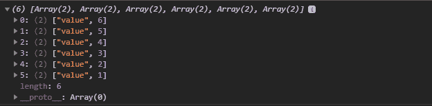
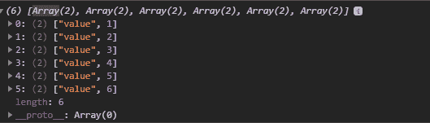

# D3.js 节点. sort()函数

> 原文:[https://www.geeksforgeeks.org/d3-js-node-sort-function/](https://www.geeksforgeeks.org/d3-js-node-sort-function/)

**D3.js** 中的 **node.sort()** 函数用于对给定层次数据的每一层的子级进行排序。比较器功能可用于定义排序的基础。

**语法:**

```
node.sort( compare )
```

**参数:**该函数接受如上所述的单个参数，如下所述:

*   **compare:** 它是一个指定排序应该基于的函数。

**返回值:**该函数返回一个对象。

下面的例子说明了 D3.js 中的 **node.sort()** 函数:

**例 1:**

## 超文本标记语言

```
<!DOCTYPE html>
<html>

<head>
    <script src="https://d3js.org/d3.v4.min.js">
    </script>
</head>

<body>
    <script>

        // Construct a tree
        var tree = {

            // Specify the root node
            name: "rootNode",
            children: [
                { value: 1 },
                { value: 2 },
                { value: 3 },
                { value: 4 },
                { value: 5 },
                { value: 6 },
            ]
        };

        var obj = d3.hierarchy(tree);

        // Use the sort() function to sort
        // the nodes in descending order
        var sorted = obj.sum(d => d.value)
            .sort((a, b) =>
                d3.descending(a.value, b.value));

        // Show the sorted output
        console.log(
            sorted.children.map(
                d => ["value", d.value])
        );
    </script>
</body>

</html>
```

**输出:**

[](https://media.geeksforgeeks.org/wp-content/uploads/20200824123045/01159.png)

**例 2:**

## 超文本标记语言

```
<!DOCTYPE html>
<html>

<head>
    <script src="https://d3js.org/d3.v4.min.js">
    </script>
</head>

<body>
    <script>
        // Construct a tree
        var tree = {

            // Specify the root node
            name: "rootNode",
            children: [
                { value: 1 },
                { value: 2 },
                { value: 3 },
                { value: 4 },
                { value: 5 },
                { value: 6 },
            ]
        };

        var obj = d3.hierarchy(tree);

        // Use the sort() function to sort
        // the nodes in ascending order
        var sorted = obj.sum(d => d.value)
            .sort((a, b) =>
                d3.ascending(a.value, b.value));

        // Show the sorted output
        console.log(
            sorted.children.map(d => ["value", d.value])
        )
    </script>
</body>

</html>
```

**输出:**

[](https://media.geeksforgeeks.org/wp-content/uploads/20200824123129/01160.png)