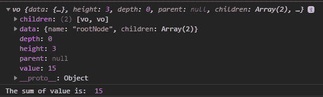

# D3.js node.sum()函数

> 原文:[https://www.geeksforgeeks.org/d3-js-node-sum-function/](https://www.geeksforgeeks.org/d3-js-node-sum-function/)

d3.js 中的 **node.sum()** 函数用于计算特定节点的指定值函数。此函数的 node.value 属性包含指定函数返回的值。

**语法:**

```
node.sum(value);

```

**参数:**该函数接受如上所述的单个参数，如下所述:

*   **值:**这需要为每个节点计算一个函数。

**返回值:**该函数返回一个对象。

下面是上面给出的函数的几个例子。

**例 1:**

## 超文本标记语言

```
<!DOCTYPE html> 
<html lang = "en"> 
<head> 
    <meta charset = "UTF-8" /> 
    <meta name = "viewport"
          path1tent = "width=device-width, 
                       initial-scale = 1.0"/> 
    <script src =
"https://d3js.org/d3.v4.min.js">
    </script>
</head> 

<body> 
    <script> 
       // Constructing a tree
        var tree={
            name: "rootNode", // Root node
            children: [
                {
                    name: "child1", // Child of root node
                    value: 2
                },
                {
                    name: "child2", // Child of root node
                    value: 3,
                    children: [
                        {
                            name: "grandchild1", // Child of child2
                            value: 1,
                            children:[
                                {name: "grand_granchild1_1",value: 4},                              
                                // Child of grandchild1
                                {name: "grand_granchild1_2",value: 5}                     
                               // Child of grandchild1
                            ]
                        },
                        {
                            name: "grandchild2",
                            children:[
                                {name: "grand_granchild2_1"},  
                                // Child of grandchild2
                                {name: "grand_granchild2_2"}  
                                // Child of grandchild2
                            ]
                        },
                    ]
                }
            ]
        };

        var obj = d3.hierarchy(tree);
        var grandchild2=obj.children[1].children[1];

        var sum=obj.sum(d=>d.value);
        console.log(sum);
        console.log("The sum of value is: ",sum.value);
    </script> 
</body> 
</html>
```

**输出:**

[](https://media.geeksforgeeks.org/wp-content/uploads/20200821154227/01106.png)

**例 2:**

## 超文本标记语言

```
<!DOCTYPE html> 
<html lang = "en"> 
<head> 
    <meta charset = "UTF-8" /> 
    <meta name = "viewport"
          path1tent = "width=device-width, 
                       initial-scale = 1.0"/> 
    <script src =
"https://d3js.org/d3.v4.min.js">
    </script>
</head> 
<body> 
    <script> 
    // Constructing a tree
        var tree={
            name: "rootNode", // Root node
            children: [
                {value:1},
                {value:2},
                {value:3},
                {value:4},
                {value:5},
                {value:6},
            ]
        };

        var obj = d3.hierarchy(tree);

        var sum=obj.sum(d=>d.value*12);
        // 1 + 2 + 3 + 4 + 5 + 6 = 21*12=252
        console.log(sum);
        console.log("The value is: ",sum.value);
    </script> 
</body> 
</html>
```

**输出:**

[](https://media.geeksforgeeks.org/wp-content/uploads/20200824113744/01158.png)