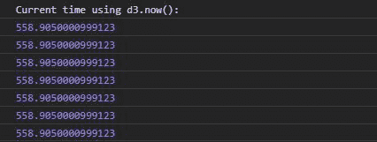
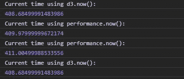

# D3.js now()功能

> 原文:[https://www.geeksforgeeks.org/d3-js-now-function/](https://www.geeksforgeeks.org/d3-js-now-function/)

D3.js 中的 **d3.now()** 函数用于根据 javascript 中可用的 performance.now()函数返回当前时间，如果该函数不可用，则返回 date.now()函数用于返回当前时间。

**语法:**

```
d3.now()
```

**参数:**不取任何参数。

**返回值:**返回数据类型字符串的时间。

**注意:**不同机器的输出可能不同。

下面给出了上述函数的几个例子。

**例 1:**

```
<!DOCTYPE html>
<html lang="en">
<head>
  <meta charset="UTF-8">
  <meta name="viewport"
        content="width=device-width,
                 initial-scale=1.0">
  <title>Document</title>
</head>
<style>
</style>
<body>
  <!-- Fetching from CDN of D3.js -->
  <script type = "text/javascript" 
          src = "https://d3js.org/d3.v4.min.js">
  </script>
  <script>
    console.log("Current time using d3.now(): ")
    console.log(d3.now())
    console.log(d3.now())
    console.log(d3.now())
    console.log(d3.now())
    console.log(d3.now())
    console.log(d3.now())
    console.log(d3.now())
  </script>
</body>
</html>
```

**输出:**



**例 2:** 注意性能. now()和 d3.now()的差异。

```
<!DOCTYPE html>
<html lang="en">
<head>
  <meta charset="UTF-8">
  <meta name="viewport" 
        content="width=device-width,
                 initial-scale=1.0">
  <title>Document</title>
</head>
<style>
</style>
<body>
  <!-- Fetching from CDN of D3.js -->
  <script type = "text/javascript" 
          src = "https://d3js.org/d3.v4.min.js">
  </script>
  <script>
    console.log("Current time using d3.now(): ")
    console.log(d3.now())
    console.log("Current time using performance.now(): ")
    console.log(performance.now())

    console.log("Current time using performance.now(): ")
    console.log(performance.now())
    console.log("Current time using d3.now(): ")
    console.log(d3.now())
  </script>
</body>
</html>
```

**输出:**

