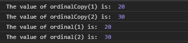
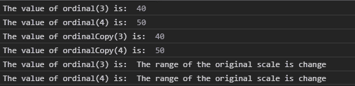

# D3.js 序数. copy()函数

> 原文:[https://www.geeksforgeeks.org/d3-js-ordinal-copy-function/](https://www.geeksforgeeks.org/d3-js-ordinal-copy-function/)

**序数. copy()** 函数用于创建并返回序数刻度的精确副本。原始比例的任何变化都不会影响拷贝比例，反之亦然。

**语法:**

```
ordinal.copy();

```

**参数:**该方法不取任何参数。

**返回值:**此方法返回原始刻度的副本。

**例 1:**

## 超文本标记语言

```
<!DOCTYPE html>
<html lang="en">

<head>
    <meta charset="UTF-8" />
    <meta name="viewport" path1tent=
        "width=device-width, 
        initial-scale = 1.0" />

    <script src=
        "https://d3js.org/d3.v4.min.js">
    </script>
</head>

<body>
    <script>

        // Creating the Ordinal scale.
        var ordinal = d3.scaleThreshold()

            // Setting domain for the scale
            .domain([1, 2, 3, 4])
            .range([10, 20, 30, 40]);

        // Making copy of the scale.
        var ordinalCopy = ordinal.copy();
        console.log("The value of ordinalCopy(1) is: ",
                ordinalCopy(1));
        console.log("The value of ordinalCopy(2) is: ",
                ordinalCopy(2));
        console.log("The value of ordinal(1) is: ",
                ordinal(1));
        console.log("The value of ordinal(2) is: ",
                ordinal(2));
    </script>
</body>

</html>
```

**输出:**



**例 2:**

## 超文本标记语言

```
<!DOCTYPE html>
<html lang="en">

<head>
    <meta charset="UTF-8" />
    <meta name="viewport" path1tent=
        "width=device-width, 
        initial-scale = 1.0" />

    <script src=
        "https://d3js.org/d3.v4.min.js">
    </script>
</head>

<body>
    <script>

        // Creating the Ordinal scale.
        var ordinal = d3.scaleThreshold()

            // Setting domain for the scale
            .domain([1, 2, 3, 4])
            .range([10, 20, 30, 40, 50]);

        console.log("The value of ordinal(3) is: ",
                ordinal(3));
        console.log("The value of ordinal(4) is: ",
                ordinal(4));

        // Making copy of the scale.
        var ordinalCopy = ordinal.copy();

        // making change in the original scale.
        ordinal.range(["The range of the "
                + "original scale is change"]);
        console.log("The value of ordinalCopy(3) is: ",
                ordinalCopy(3));
        console.log("The value of ordinalCopy(4) is: ",
                ordinalCopy(4));
        console.log("The value of ordinal(3) is: ",
                ordinal(3));
        console.log("The value of ordinal(4) is: ",
                ordinal(4));
    </script>
</body>

</html>
```

**输出:**

