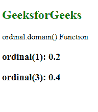
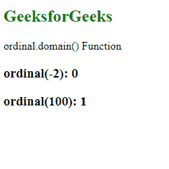

# D3.js 序数. domain()函数

> 原文:[https://www . geesforgeks . org/D3-js-序数-域-函数/](https://www.geeksforgeeks.org/d3-js-ordinal-domain-function/)

d3.js 中的**序数. domain()** 函数用于设置序数刻度的定义域。在这种情况下，域的第一个元素被映射到范围的第一个元素，域的第二个元素被映射到范围的第二个元素，以此类推。

**语法:**

```
ordinal.domain([domain]);

```

**参数:**该函数只取一个参数，如上所述，如下所述。

*   **域:**取刻度的最小值和最大值。

**返回值:**这个函数不返回任何东西。

**例 1:**

## 超文本标记语言

```
<!DOCTYPE html>
<html lang="en">

<head>
    <meta charset="UTF-8" />
    <meta name="viewport" path1tent=
        "width=device-width, 
        initial-scale=1.0" />

    <script src=
        "https://d3js.org/d3.v4.min.js">
    </script>
</head>

<body>
    <h2 style="color:green">
        GeeksforGeeks
    </h2>

    <p>ordinal.domain() Function </p>

    <script>
        var ordinal = d3.scaleThreshold()

            // Setting domain for the scale
            .domain([1, 2, 3, 4])

            // Range for the domain
            .range([0.1, 0.2, 0.3, 0.4]);

        document.write("<h3>ordinal(1): "
                + ordinal(1) + "</h3>");
        document.write("<h3>ordinal(3): "
                + ordinal(3) + "</h3>");
    </script>
</body>

</html>
```

**输出:**



**例 2:** 当输入值在域外时。

## 超文本标记语言

```
<!DOCTYPE html>
<html lang="en">

<head>
    <meta charset="UTF-8" />
    <meta name="viewport" path1tent=
        "width=device-width, 
        initial-scale=1.0" />

    <script src=
        "https://d3js.org/d3.v4.min.js">
    </script>
</head>

<body>
    <h2 style="color:green">
        GeeksforGeeks
    </h2>

    <p>ordinal.domain() Function </p>

    <script>
        var ordinal = d3.scaleThreshold()

            // Setting domain for the scale
            .domain([-1, -2, 3, 4])

        document.write("<h3>ordinal(-2): " 
                + ordinal(-2) + "</h3>");
        document.write("<h3>ordinal(100): " 
                + ordinal(100) + "</h3>");
    </script>
</body>

</html>
```

**输出:**

