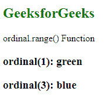
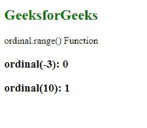

# D3.js 序数. range()函数

> 原文:[https://www.geeksforgeeks.org/d3-js-ordinal-range-function/](https://www.geeksforgeeks.org/d3-js-ordinal-range-function/)

d3.js 中的**序数. range()** 函数用于设置序数刻度的范围。如果与域值相比，范围内的元素数量较少，则从指定范围开始缩放重用值。

**语法:**

```
ordinal.range([range]);

```

**参数:**该函数只取一个参数，如上所述，如下所述。

*   **范围:**该参数接受离散值数组。

**返回值:**这个函数不返回任何东西。

**例 1:**

## 超文本标记语言

```
<!DOCTYPE html>
<html lang="en">

<head>
    <meta charset="UTF-8" />
    <meta name="viewport" path1tent=
        "width=device-width, 
        initial-scale=1.0" />

    <script src=
        "https://d3js.org/d3.v4.min.js">
    </script>
</head>

<body>
    <h2 style="color:green">
        GeeksforGeeks
    </h2>

    <p>ordinal.range() Function </p>

    <script>
        var ordinal = d3.scaleThreshold()

            // Setting domain for the scale
            .domain([1, 2, 3, 4])

            // Range for the scale
            .range(["red", "green", "blue"]);

        document.write("<h3>ordinal(1): "
                + ordinal(1) + "</h3>");
        document.write("<h3>ordinal(3): "
                + ordinal(3) + "</h3>");
    </script>
</body>

</html>
```

**输出:**



**例 2:**

## 超文本标记语言

```
<!DOCTYPE html>
<html lang="en">

<head>
    <meta charset="UTF-8" />
    <meta name="viewport" path1tent=
        "width=device-width, 
        initial-scale=1.0" />

    <script src=
        "https://d3js.org/d3.v4.min.js">
    </script>
</head>

<body>
    <h2 style="color:green">
        GeeksforGeeks
    </h2>

    <p>ordinal.range() Function </p>

    <script>
        var ordinal = d3.scaleThreshold()

            // Setting domain for the scale
            .domain([-2, 3, 4])

        // 10 does not lie in the domain
        document.write("<h3>ordinal(-3): "
                + ordinal(-3) + "</h3>");
        document.write("<h3>ordinal(10): " 
                + ordinal(10) + "</h3>");
    </script>
</body>

</html>
```

**输出:**

