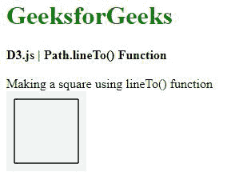

# D3.js path.lineTo()函数

> 原文:[https://www.geeksforgeeks.org/d3-js-path-lineto-function/](https://www.geeksforgeeks.org/d3-js-path-lineto-function/)

**path.lineTo()** 函数用于从当前点集画一条线到给定点。

**语法:**

```
path.lineTo(x, y);
```

**参数:**取两个参数，如上所述，如下所述。

*   **x:** 是要画线的点的 x 位置。
*   **y:** 是要画线的点的 y 位置。

**返回值:**不返回值。

**例 1:** 从(0，0)到(100，100)做一条线。

## 超文本标记语言

```
<!DOCTYPE html>
<html lang="en">

<head>
    <meta charset="UTF-8">
    <meta name="viewport" path1tent=
        "width=device-width,initial-scale=1.0">

    <script src=
        "https://d3js.org/d3.v4.min.js">
    </script>

    <style>
        h1 {
            color: green;
        }

        svg {
            background-color: #f2f2f2;
        }

        .path2 {
            stroke: #000;
        }
    </style>
</head>

<body>
    <div>
        <h1>GeeksforGeeks</h1>
        <b>D3.js | Path.lineTo() Function</b>
        <br><br>
        Making a line from (0, 0) to (100, 100) <br>
        <svg width="100" height="100">
            <path class="path2">
        </svg>
    </div>

    <script>

        // Creating a path 
        var path = d3.path();
        path.moveTo(0, 0);

        // Making line to x:100 and y:100 
        path.lineTo(100, 100);

        // Closing the path 
        path.closePath();
        d3.select(".path2").attr("d", path); 
    </script>
</body>

</html>
```

**输出:**


**示例 2:** 使用 lineTo()函数制作正方形。

## 超文本标记语言

```
<!DOCTYPE html>
<html lang="en">

<head>
    <meta charset="UTF-8">
    <meta name="viewport" path1tent=
        "width=device-width,initial-scale=1.0">

    <script src=
        "https://d3js.org/d3.v4.min.js">
    </script>

    <style>
        h1 {
            color: green;
        }

        svg {
            background-color: #f2f2f2;
        }

        .path2 {
            stroke: #000;
        }
    </style>
</head>

<body>
    <div>
        <h1>GeeksforGeeks</h1>
        <b>D3.js | Path.lineTo() Function</b>
        <br><br>
        Making a square using lineTo() function<br>
        <svg width="100" height="100">
            <path class="path2">
        </svg>
    </div>

    <script>

        // Creating a path 
        var path = d3.path();
        path.moveTo(10, 10);

        // Making line to x:90 and y:10 
        path.lineTo(90, 10);

        // Closing the path 
        path.closePath();
        path.moveTo(90, 10);

        // Making line to x:90 and y:90 
        path.lineTo(90, 90);

        // Closing the path 
        path.closePath();
        path.moveTo(90, 90);

        // Making line to x:10 and y:90 
        path.lineTo(10, 90);

        // Closing the path 
        path.closePath();
        path.moveTo(10, 90);

        // Making line to x:10 and y:10 
        path.lineTo(10, 10);

        // Closing the path 
        path.closePath();
        d3.select(".path2").attr("d", path); 
    </script>
</body>

</html>
```

**输出:**

