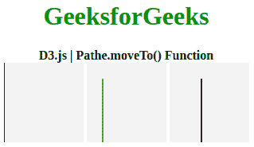
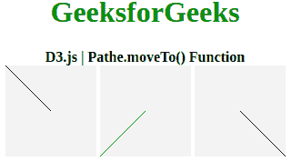

# D3.js | Path.moveTo()函数

> 原文:[https://www.geeksforgeeks.org/d3-js-path-moveto-function/](https://www.geeksforgeeks.org/d3-js-path-moveto-function/)

**D3.js** 主要用于在 HTML svg 元素上制作图形和可视化数据。D3 不知何故与数据驱动文档有关。 **Path.moveTo()函数**用于移动 svg 元素内的一个点。该库还能够绘制**模拟、2D 图形和三维图形**，并用于生成**动态交互式数据可视化**。它利用了可伸缩矢量图形，即 SVG 元素。该库主要处理 **svg 向量。**

**语法:**

```
Path.moveTo(x,y)

```

**参数:**该函数接受两个参数，如上所述，如下所述:

*   **X:** 此参数表示元素的 X 位置。
*   **Y:** 此参数表示元素的 Y 位置。

以下示例说明了 **D3.js** 中的 **Path.moveTo()** 功能:

**例 1:**

## java 描述语言

```
<!DOCTYPE html>
<html lang="en">
   <head>
      <meta charset="UTF-8">
      <meta name="viewport" 
            path1tent="width=device-width, 
                       initial-scale=1.0">
      <title>Document</title>
   </head>
   <style>
      h1 {
          color: green;
      }
      div {
          display: inline-block;
      }
      svg{
          background-color: #f2f2f2;
      }
      .path1{
          stroke: #000;
      }
      .path2{
          stroke: green;
      }
      .path3{
          stroke: #000;
      }
   </style>
   <body>
      <center>
        <div>
           <h1>GeeksforGeeks</h1>
           <b>D3.js | Pathe.moveTo() Function</b>
           <br>
           <svg width="100" height="100">
              <path class="path1">
           </svg>

           <svg width="100" height="100">
              <path class="path2">
           </svg>

           <svg width="100" height="100">
              <path class="path3">
           </svg>
        </div>
        <script src =
"https://d3js.org/d3.v4.min.js">
        </script>
        <script>;
           // Creating a path
           var path1= d3.path(); 
               path1.moveTo(0, 0); 

               // Making line to x:0 and y:100 
               path1.lineTo(0, 100); 

               // Closing the path
               path1.closePath(); 
           d3.select(".path1").attr("d",path1);
           var path2= d3.path();

               // Start point are x:20 and y:20
               path2.moveTo(20, 20); 
               path2.lineTo(20, 100);
               path2.closePath();
           d3.select(".path2").attr("d",path2);
           var path3= d3.path();

               // Start point are  x:40 and y:20
               path3.moveTo(40,20); 
               path3.lineTo(40, 100);
               path3.closePath();
           d3.select(".path3").attr("d",path3);
        </script>
      </center>
   </body>
</html>
```

**输出:**



**例 2:**

## 超文本标记语言

```
<!DOCTYPE html>
<html lang="en">
   <head>
      <meta charset="UTF-8">
      <meta name="viewport" 
            path1tent="width=device-width, 
                       initial-scale=1.0">
      <title>Document</title>
   </head>
   <style>
      h1 {
          color: green;
      }
      div {
          display: inline-block;
      }
      svg{
          background-color: #f2f2f2;
      }
      .path1{
          stroke: #000;
      }
      .path2{
          stroke: green;
      }
      .path3{
          stroke: #000;
      }
   </style>
   <body>
      <center>
        <div>
           <h1>GeeksforGeeks</h1>
           <b>D3.js | Pathe.moveTo() Function</b>
           <br>
            <svg width="100" height="100">
              <path class="path1">
            </svg>
            <svg width="100" height="100">
              <path class="path2">
            </svg>
            <svg width="100" height="100">
              <path class="path3">
            </svg>
        </div>
        <script src = 
"https://d3js.org/d3.v4.min.js">
        </script>
        <script>;
          // Creating a path
          var path1= d3.path(); 

              // Start point are x:0 y:0
              path1.moveTo(0, 0); 

              // Making line to x:50 and y:50
              path1.lineTo(50, 50); 

              // Closing the path
              path1.closePath(); 
          d3.select(".path1").attr("d",path1);
          var path2= d3.path();

              // Start point are x:0 and y:100
              path2.moveTo(0, 100); 
              path2.lineTo(50, 50);
              path2.closePath();
          d3.select(".path2").attr("d",path2);
          var path3= d3.path();

              // Start point are  x:100 and y:100
              path3.moveTo(100,100); 
              path3.lineTo(50, 50);
              path3.closePath();
          d3.select(".path3").attr("d",path3);
        </script>
      </center>
   </body>
</html>
```

**输出:**

