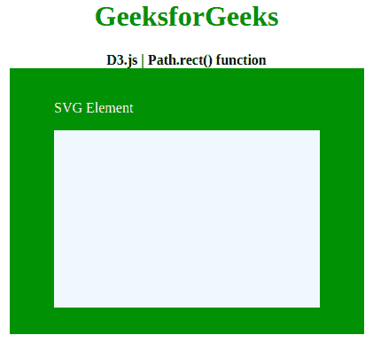
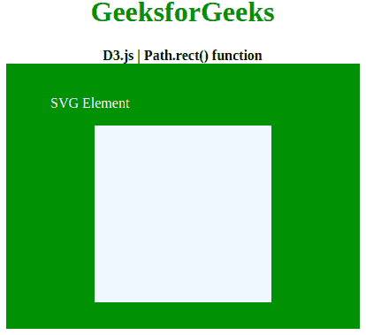

# D3.js | Path.rect()函数

> 原文:[https://www.geeksforgeeks.org/d3-js-path-rect-function/](https://www.geeksforgeeks.org/d3-js-path-rect-function/)

**D3.js** 是 Javascript 中的一个库，这个库主要用于在 HTML SVG 元素上制作图形和可视化数据。D3 代表**数据驱动文档**，主要用于数据可视化。 **Path.rect()** 用于在 svg 元素中制作矩形。

**语法:**

```
Path.rect(x, y, w, h);
```

**参数:**该函数接受四个参数，如上所述，如下所述:

*   **X:** 是矩形的 X 位置。
*   **Y:** 是矩形的 Y 位置。
*   **W:** 是矩形的宽度。
*   **H:** 是矩形的高度

下面例子说明了 D3.js 中的函数

**例 1:**

## java 描述语言

```
<!DOCTYPE html>
<html lang="en">
   <head>
      <meta charset="UTF-8">
      <meta name="viewport" 
            path1tent="width=device-width, 
                       initial-scale=1.0">
      <title>D3.js | Path.rect() function</title>
   </head>
   <style>
      h1 {
          color: green;
      }
      body {
          text-align: center;
      }
      svg{
      background-color: green;
      }
      .path1{
      fill: aliceblue;
      }
   </style>
   <body>
      <div>
         <h1>GeeksforGeeks</h1>
         <b>D3.js | Path.rect() function</b>
         <br>
         <svg width="400" height="300">
            <text x="50" y="50" font-family="Verdana" 
                  fill="white">
                SVG Element
            </text>
            <path class="path1">
         </svg>
      </div>
      <script src =
"https://d3js.org/d3.v4.min.js">
      </script>
      <script>
         // Creating path object
         var path1= d3.path();

         // Creating rectangle at x:50 and y:100
         // and height:200, width:300
         path1.rect(50,70,300,200); 
         d3.select(".path1").attr("d",path1);
      </script>
   </body>
</html>
```

**输出:**



**例 2:**

## java 描述语言

```
<!DOCTYPE html>
<html lang="en">
   <head>
      <meta charset="UTF-8">
      <meta name="viewport" 
            path1tent="width=device-width, 
                       initial-scale=1.0">
      <title>D3.js | Path.rect() function</title>
   </head>
   <style>
      h1 {
          color: green;
      }
      body {
          text-align: center;
      }
      svg{
      background-color: green;
      }
      .path1{
      fill: aliceblue;
      }
   </style>
   <body>
      <div>
         <h1>GeeksforGeeks</h1>
         <b>D3.js | Path.rect() function</b>
         <br>
         <svg width="400" height="300">
            <text x="50" y="50" font-family="Verdana" 
                  fill="white">
                SVG Element
            </text>
            <path class="path1">
         </svg>
      </div>
      <script src =
"https://d3js.org/d3.v4.min.js">
      </script>
      <script>
         // Creating path object
         var path1= d3.path();

         // Creating rectangle at x:50 and y:100
         // and height:200, width:300
         path1.rect(100, 70, 200, 200); 
         d3.select(".path1").attr("d",path1);
      </script>
   </body>
</html>
```

**输出:**

