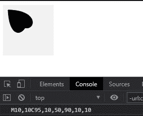
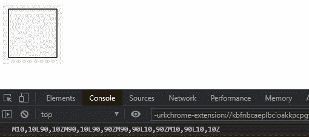

# D3.js path.toString()函数

> 原文:[https://www.geeksforgeeks.org/d3-js-path-tostring-function/](https://www.geeksforgeeks.org/d3-js-path-tostring-function/)

d3.js 中的 **path.toString()** 函数用于返回绘制形状路径的字符串表示。路径表示是根据 SVG 的路径数据规范。

**语法:**

```
path.toString() 
```

**参数:**此功能不接受任何参数。

**返回值:**这个函数返回一个字符串。

**例 1:**

## 超文本标记语言

```
<!DOCTYPE html>
<html lang="en">

<head>
    <meta charset="UTF-8">
    <meta name="viewport" path1tent=
        "width=device-width,initial-scale=1.0">

    <script src=
        "https://d3js.org/d3.v4.min.js">
    </script>

    <style>
        h1 {
            color: green;
        }

        svg {
            background-color: #f2f2f2;
        }

        .path2 {
            stroke: #000;
        }
    </style>
</head>

<body>
    <div>
        <svg width="100" height="100">
            <path class="path2">
        </svg>
    </div>

    <script>

        // Creating a path 
        var path = d3.path();
        path.moveTo(10, 10);
        path.bezierCurveTo(95, 10, 50, 90, 10, 10)

        // Printing the string of the path
        console.log(path.toString())
        path.bezierCurveTo(90, 10, 15, 110, 10, 10)

        // Closing the path 
        path.closePath();
        d3.select(".path2").attr("d", path); 
    </script>
</body>

</html>
```

**输出:**此形状的路径字符串在控制台中给出。



**例 2:**

## 超文本标记语言

```
<!DOCTYPE html>
<html lang="en">

<head>
    <meta charset="UTF-8">
    <meta name="viewport" path1tent=
        "width=device-width, initial-scale=1.0">

    <script src=
        "https://d3js.org/d3.v4.min.js">
    </script>

    <style>
        h1 {
            color: green;
        }

        svg {
            background-color: #f2f2f2;
        }

        .path2 {
            stroke: #000;
        }
    </style>
</head>

<body>
    <div>
        <svg width="100" height="100">
            <path class="path2">
        </svg>
    </div>

    <script>

        // Creating a path 
        var path = d3.path();
        path.moveTo(10, 10);

        // Making line to x:90 and y:10 
        path.lineTo(90, 10);

        // Closing the path 
        path.closePath();
        path.moveTo(90, 10);
        path.lineTo(90, 90);

        // Closing the path 
        path.closePath();
        path.moveTo(90, 90);
        path.lineTo(10, 90);

        // Closing the path 
        path.closePath();
        path.moveTo(10, 90);
        path.lineTo(10, 10);

        // Closing the path 
        path.closePath();

        // Printing the string of the path
        console.log(path.toString())
        d3.select(".path2").attr("d", path); 
    </script>
</body>

</html>
```

**输出:**正方形的路径字符串在控制台中给出。

