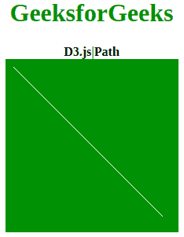
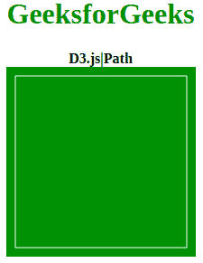

# D3.js |路径

> 原文:[https://www.geeksforgeeks.org/d3-js-path/](https://www.geeksforgeeks.org/d3-js-path/)

**D3.js** 主要用于在 HTML SVG 元素上制作图形和可视化数据。D3 不知何故与数据驱动文档有关。**路径**用于使 SVG，Path 创建一个具有画布路径所有属性的对象。该库还能够绘制模拟图、2D 图和三维图。投影也是这个库的一个固有特性。

**语法:**

```
path.
```

**参数:**有**有**有**不需要参数或参数。**

**Return:** 该 Path 返回一个对象，该对象的路径方法与 HTML 画布提供的路径方法相同。

**例 1:**

## 超文本标记语言

```
<!DOCTYPE html>
<html lang="en">
   <head>
      <meta charset="UTF-8">
      <meta name="viewport" 
            path1tent="width=device-width, 
                       initial-scale=1.0">
      <title>D3.js| Path</title>
   </head>
   <style>
      body {
          text-align: center;
      }
      h1 {
          color: green;
      }
      svg{
      background-color: green;
      }
      .path1{
      fill: aliceblue;
      }
   </style>
   <body>
      <h1>GeeksforGeeks</h1>
      <b>D3.js|Path</b>
      <div>
         <svg width="220" height="220">
            <path class="path1" stroke="white">
         </svg>
      </div>
      <script src = 
"https://d3js.org/d3.v4.min.js"></script>
      <script>
         var path = d3.path();

         // Starting points are x:10 and y:10
         path.moveTo(10, 10); 

         // Making line to points x:200 and y:200
         path.lineTo(200, 200); 
         d3.select(".path1").attr("d",path)
      </script>
   </body>
</html>
```

**输出:**



**例 2:**

## 超文本标记语言

```
<!DOCTYPE html>
<html lang="en">
   <head>
      <meta charset="UTF-8">
      <meta name="viewport" 
            path1tent="width=device-width, 
                       initial-scale=1.0">
      <title>D3.js| Path</title>
   </head>
   <style>
      body {
          text-align: center;
      }
      h1 {
          color: green;
      }
      svg{
      background-color: green;
      }
      .path1{
      fill: aliceblue;
      }
   </style>
   <body>
      <h1>GeeksforGeeks</h1>
      <b>D3.js|Path</b>
      <div>
         <svg width="210" height="210">
            <path class="path1" stroke="white">
         </svg>
      </div>
      <script src = 
"https://d3js.org/d3.v4.min.js"></script>
      <script>
         var path = d3.path();
         // Point start at x:10 y:10
         path.moveTo(10, 10);  

         // Making line to x:10 y:200
         path.lineTo(10, 200); 

         // Point start at x:10 y:10
         path.moveTo(10, 200); 

         // Making line to x:200 y:200
         path.lineTo(200, 200); 

         // Point start at x:200 y:200
         path.moveTo(200, 200); 

         // Making line to x:200 y:10
         path.lineTo(200, 10);

         // Point start at x:200 y:10
         path.moveTo(200, 10); 

         // Making line to x:10 y:10
         path.lineTo(10, 10);  
         d3.select(".path1").attr("d",path)
      </script>
   </body>
</html>
```

**输出:**

