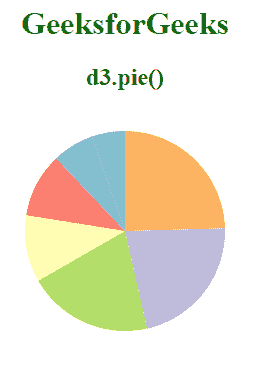
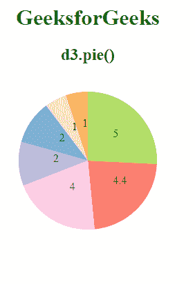

# D3.js 派()功能

> 原文:[https://www.geeksforgeeks.org/d3-js-pie-function/](https://www.geeksforgeeks.org/d3-js-pie-function/)

**d3.pie()** 用于构建具有默认设置的 pie 生成器。这个饼图生成器获取一个数据数组，然后返回一个对象数组，其中包含每个弧角的详细信息。

**语法:**

```
d3.pie();

```

**参数:**此功能不接受任何参数。

**返回值:**这个函数返回一个饼图生成器。

下面是上面给出的函数的几个例子。

**例 1:**

## 超文本标记语言

```
<!DOCTYPE html> 
<html lang="en"> 

<head> 
    <meta charset="UTF-8" /> 
    <meta name="viewport"
          content="width=device-width, 
                  initial-scale=1.0"/> 

    <!--Fetching from CDN of D3.js -->
    <script src= 
        "https://d3js.org/d3.v6.min.js"> 
    </script>
</head>

<body> 
    <div style="width:300px; height:300px;">
        <center>
            <h1 style="color:green">
                GeeksforGeeks
            </h1> 

            <h2>
                d3.pie()
            </h2> 
        </center>

        <svg width="300" height="300">
        </svg>

    </div>
    <script> 
        var data = [1.1,2.2,4.46,2.12,1.36,5.002445,4.1242];

        // Selecting SVG using d3.select()
        var svg = d3.select("svg");

        let g = svg.append("g")
               .attr("transform", "translate(150,120)");

        // Creating Pie generator
        var pie = d3.pie();

        // Creating arc
        var arc = d3.arc()
                    .innerRadius(0)
                    .outerRadius(100);

        // Grouping different arcs
        var arcs = g.selectAll("arc")
                    .data(pie(data))
                    .enter()
                    .append("g");

        // Appending path 
        arcs.append("path")
            .attr("fill", (data, i)=>{
                let value=data.data;
                return d3.schemeSet3[i];
            })
            .attr("d", arc);
    </script> 
</body> 

</html>
```

**输出:**

[](https://media.geeksforgeeks.org/wp-content/uploads/20200825102233/01.PNG)

**例 2:**

## 超文本标记语言

```
<!DOCTYPE html> 
<html lang="en"> 

<head> 
    <meta charset="UTF-8" /> 
    <meta name="viewport"
          content="width=device-width, 
                  initial-scale=1.0"/> 

    <!--Fetching from CDN of D3.js -->
    <script src= 
        "https://d3js.org/d3.v6.min.js"> 
    </script>
</head>

<body> 
    <div style="width:300px; height:300px;">
        <center>
            <h1 style="color:green">
                GeeksforGeeks
            </h1> 

            <h2>
                d3.pie()
            </h2> 

        </center>

        <svg width="300" height="300">
        </svg>

    </div>

    <script> 
        var data = [1,2,4.4,2,1,5,4];

        // Selecting SVG using d3.select()
        var svg = d3.select("svg");

        // Creating Pie generator
        var pie = d3.pie();

        // Creating arc
        var arc = d3.arc()
                    .innerRadius(0)
                    .outerRadius(100);

        let g = svg.append("g")
                   .attr("transform", "translate(150,120)");

        // Grouping different arcs
        var arcs = g.selectAll("arc")
                    .data(pie(data))
                    .enter()
                    .append("g");

        // Appending path 
        arcs.append("path")
            .attr("fill", (data, i)=>{
                let value=data.data;
                return d3.schemeSet3[i+1];
            })
            .attr("d", arc);

        // Adding data to each arc
        arcs.append("text")
            .attr("transform",(d)=>{ 
                    return "translate("+ 
                    arc.centroid(d) + ")"; 
            })
            .text(function(d){
               return d.data; 
               });
    </script> 
</body>

</html>
```

**输出:**

[](https://media.geeksforgeeks.org/wp-content/uploads/20200825102729/01.PNG)