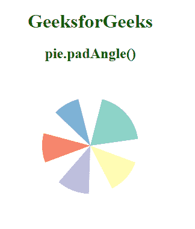
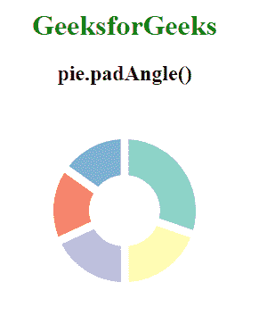

# D3.js pie.padAngle()函数

> 原文:[https://www.geeksforgeeks.org/d3-js-pie-padangle-function/](https://www.geeksforgeeks.org/d3-js-pie-padangle-function/)

**D3.js** 中的 **pie.padAngle()功能**用于设置连续圆弧之间的填充角度。指定角度后，它会将焊盘角度设置为给定的角度或函数，并返回饼图生成器。如果未指定角度，它将返回当前填充角度访问器，默认为无填充。

**语法:**

```
pie.padAngle( angle )
```

**参数:**该函数接受如上所述的单个参数，如下所述:

*   **角度:**是以弧度为单位指定焊盘角度的数字或函数。这是一个可选参数。

**返回值:**这个函数不返回任何东西。

下面给出几个 D3.js 中 **pie.padAngle()** 函数的例子；

**例 1:**

## 超文本标记语言

```
<!DOCTYPE html>
<html>

<head>
    <script src="https://d3js.org/d3.v6.min.js">
    </script>
</head>

<body>
    <div style="width:300px; height:300px;">
        <center>
            <h1 style="color:green">
                GeeksforGeeks
            </h1>
            <h2>
                pie.padAngle()
            </h2>
        </center>
        <svg width="300" height="250">
        </svg>
    </div>
    <script>
        // Data to be added in the pie chart
        var data = [
            { "property": "p5", "value": 19 },
            { "property": "p5", "value": 12 },
            { "property": "p4", "value": 11 },
            { "property": "p3", "value": 10 },
            { "property": "p2", "value": 9 },
        ]

        // Selecting SVG using d3.select()
        var svg = d3.select("svg");

        // Creating Pie generator
        var pie = d3.pie()
            .value((d) => { return d.value })
            // Use of pie.padAngle() Function
            .padAngle(0.5)
            (data);
        // Creating arc
        var arc = d3.arc()
            .innerRadius(0)
            .outerRadius(80);

        let g = svg.append("g")
            .attr("transform", "translate(150,120)");

        // Grouping different arcs
        var arcs = g.selectAll("arc")
            .data(pie)
            .enter()
            .append("g");

        // Appending path
        arcs.append("path")
            .attr("fill", (data, i) => {
                return d3.schemeSet3[i];
            })
            .attr("d", arc);
    </script>
</body>

</html>
```

**输出:**



**例 2:**

## 超文本标记语言

```
<!DOCTYPE html>
<html>

<head>
    <script src="https://d3js.org/d3.v6.min.js">
    </script>
</head>

<body>
    <div style="width:300px; height:300px;">
        <center>
            <h1 style="color:green">
                GeeksforGeeks
            </h1>
            <h2>
                pie.padAngle()
            </h2>
        </center>
        <svg width="300" height="250">
        </svg>
    </div>
    <script>
        // Data to be added in the pie chart
        var data = [
            { "property": "p5", "value": 19 },
            { "property": "p5", "value": 12 },
            { "property": "p4", "value": 11 },
            { "property": "p3", "value": 10 },
            { "property": "p2", "value": 9 },
        ]

        // Selecting SVG using d3.select()
        var svg = d3.select("svg");

        // Creating Pie generator
        var pie = d3.pie()
            .value((d) => { return d.value })
            // Use of pie.padAngle() Function
            .padAngle(0.1)
            (data);
        // Creating arc
        var arc = d3.arc()
            .innerRadius(40)
            .outerRadius(80);

        let g = svg.append("g")
            .attr("transform", "translate(150,120)");

        // Grouping different arcs
        var arcs = g.selectAll("arc")
            .data(pie)
            .enter()
            .append("g");

        // Appending path
        arcs.append("path")
            .attr("fill", (data, i) => {
                return d3.schemeSet3[i];
            })
            .attr("d", arc);
    </script>
</body>

</html>
```

**输出:**

