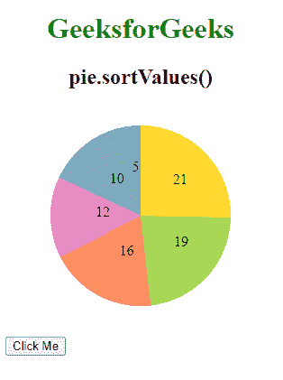
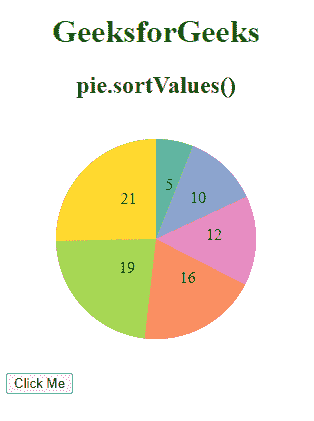
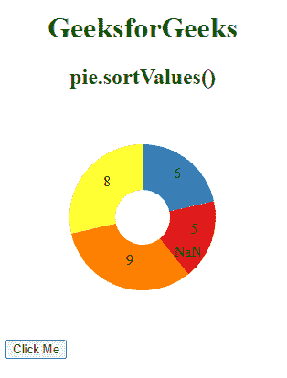

# D3.js pie.sortValues()函数

> 原文:[https://www . geesforgeks . org/D3-js-pie-sort values-function/](https://www.geeksforgeeks.org/d3-js-pie-sortvalues-function/)

**D3、js** 中的 **pie.sortValues()** 功能用于将值比较器设置为给定的功能。当未指定比较函数时，它返回当前值比较器，默认为降序。

值和数据比较器的区别在于，a 和 b 这两个参数是使用值访问器从数据数组中派生出来的值。如果 **b** 的弧必须在 **a** 的弧之前，那么比较器函数必须返回大于 0 的值。

**语法:**

```
pie.sortValues( compare(a, b) )
```

**参数:**该函数接受如上所述的单个参数，如下所述:

*   **比较器:**采用比较器功能，比较两个参数 **a** 和 **b** ，在此基础上进行排序。这是一个可选参数。

**返回值:**该函数返回当前值比较器。

下面的例子说明了 D3.js 中的 **pie.sortValues()** 函数:

**例 1:**

## 超文本标记语言

```
<!DOCTYPE html>
<html>

<head>
    <script src="https://d3js.org/d3.v6.min.js">
    </script>
</head>

<body>
    <div style="width:300px;
              height:300px;">
        <center>
            <h1 style="color:green">
                GeeksforGeeks
            </h1>
            <h2>
                pie.sortValues()
            </h2>
        </center>
        <svg width="300" height="250">
        </svg>
        <button>Click Me</button>
    </div>
    <script>
        // Data to be added in the pie chart
        var data = [
            { "property": "fp5", "value": 5 },
            { "property": "gp5", "value": 16 },
            { "property": "bp4", "value": 10 },
            { "property": "ap3", "value": 12 },
            { "property": "mp2", "value": 19 },
            { "property": "kp1", "value": 21 },
        ]

        // Selecting SVG using d3.select()
        var svg = d3.select("svg");

        // Creating Pie generator
        var pie = d3.pie()
            // Use of pie.value() Function
            .value((d) => { return d.value })
            (data);

        function updatePie() {

            // Creating Pie generator
            var pie = 0
            var pie = d3.pie()
                .value((d) => { return d.value })

                // Use of pie.sortValues() Function
                .sortValues(function (a, b) {
                    return a - b;
                })
                (data);
            // Creating arc
            var arc = d3.arc()
                .innerRadius(0)
                .outerRadius(100);

            let g = svg.append("g")
                .attr("transform", "translate(150,120)");

            // Grouping different arcs
            var arcs = g.selectAll("arc")
                .data(pie)
                .enter()
                .append("g");

            // Appending path 
            arcs.append("path")
                .attr("fill", (data, i) => {
                    return d3.schemeSet2[i];
                })
                .attr("d", arc);

            arcs.append("text")
                .attr("transform", (d) => {
                    return "translate(" +
                        arc.centroid(d) + ")";
                })
                .text(function (d) {
                    return d.value;
                });
        }
        let btn = document.querySelector("button")
        btn.addEventListener("click", updatePie);

        // Creating arc
        var arc = d3.arc()
            .innerRadius(0)
            .outerRadius(100);

        let g = svg.append("g")
            .attr("transform", "translate(150,120)");

        // Grouping different arcs
        var arcs = g.selectAll("arc")
            .data(pie)
            .enter()
            .append("g");

        // Appending path 
        arcs.append("path")
            .attr("fill", (data, i) => {
                return d3.schemeSet2[i];
            })
            .attr("d", arc);

        arcs.append("text")
            .attr("transform", (d) => {
                return "translate(" +
                    arc.centroid(d) + ")";
            })
            .text(function (d) {
                return d.value;
            });
    </script>
</body>

</html>
```

**输出:**

*   **点击按钮前:**



*   **点击按钮后:**



**例 2:**

## 超文本标记语言

```
<!DOCTYPE html>
<html>

<head>
    <script src="https://d3js.org/d3.v6.min.js">
    </script>
</head>

<body>
    <div style="width:300px; 
              height:300px;">
        <center>
            <h1 style="color:green">
                GeeksforGeeks
            </h1>
            <h2>
                pie.sortValues();
            </h2>
        </center>
        <svg width="300" height="250">
        </svg>
        <button>Clickme</button>
    </div>
    <script>
        // Data to be added in the pie chart
        var data = [
            { "property": "fp5", "value": "5" },
            { "property": "gp5", "value": "6" },
            { "property": "bp4", "value": "b" },
            { "property": "ap3", "value": "a" },
            { "property": "mp2", "value": 9 },
            { "property": "kp1", "value": "8" },
        ]

        // Selecting SVG using d3.select()
        var svg = d3.select("svg");

        // Creating Pie generator
        var pie = d3.pie()
            // Use of pie.value() Function
            .value((d) => { return d.value })
            (data);

        function updatePie() {
            // Creating Pie generator
            var pie = 0
            var pie = d3.pie()
                .value((d) => { return d.value })

                // Use of pie.sortValues() Function
                .sortValues(function (b, a) {
                    console.log("a: " + a + ",
                      b: " + b + ",
                        a - b: ", b - a);
          return b - a;
                })
                (data);
            // Creating arc
            var arc = d3.arc()
                .innerRadius(30)
                .outerRadius(80);

            let g = svg.append("g")
                .attr("transform", "translate(150,120)");

            // Grouping different arcs
            var arcs = g.selectAll("arc")
                .data(pie)
                .enter()
                .append("g");

            // Appending path 
            arcs.append("path")
                .attr("fill", (data, i) => {
                    return d3.schemeSet1[i];
                })
                .attr("d", arc);

            arcs.append("text")
                .attr("transform", (d) => {
                    return "translate(" +
                        arc.centroid(d) + ")";
                })
                .text(function (d) {
                    return d.value;
                });
        }
        let btn = document.querySelector("button")
        btn.addEventListener("click", updatePie);
        // Creating arc
        var arc = d3.arc()
            .innerRadius(30)
            .outerRadius(80);

        let g = svg.append("g")
            .attr("transform", "translate(150,120)");

        // Grouping different arcs
        var arcs = g.selectAll("arc")
            .data(pie)
            .enter()
            .append("g");

        // Appending path 
        arcs.append("path")
            .attr("fill", (data, i) => {
                return d3.schemeSet1[i];
            })
            .attr("d", arc);

        arcs.append("text")
            .attr("transform", (d) => {
                return "translate(" +
                    arc.centroid(d) + ")";
            })
            .text(function (d) {
                return d.value;
            });
    </script>
</body>

</html>
```

**输出:**

*   **点击按钮前:**



*   **点击按钮后:**

