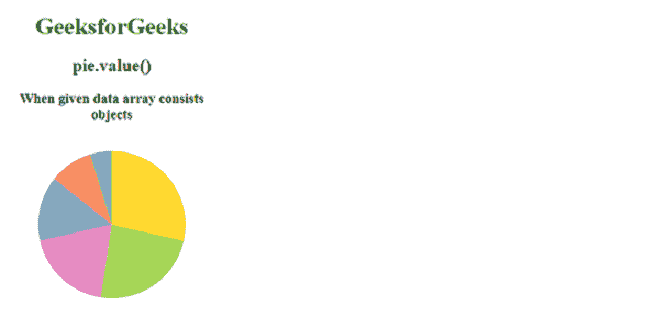
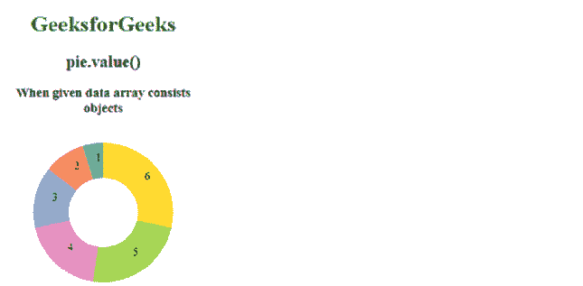

# D3 . js . pie . value()函数

> 原文:[https://www.geeksforgeeks.org/d3-js-pie-value-function/](https://www.geeksforgeeks.org/d3-js-pie-value-function/)

**pie.value()** 函数用于设置 pie 生成器函数返回的数据的 value 属性。如果指定了该值，则它会将该值设置为给定的动态或静态函数或数字。

**语法:**

```
pie.value([value]);
```

**参数:**该函数接受一个参数，如上所述，如下所述。

*   **值:**该参数取一个函数或数字。

**返回值:**这个函数不返回任何东西。

**例 1:**

## 超文本标记语言

```
<!DOCTYPE html>
<html lang="en">

<head>
    <meta charset="UTF-8" />
    <meta property="viewport" content=
        "width=device-width,initial-scale=1.0"/>

    <!--Fetching from CDN of D3.js -->
    <script src="https://d3js.org/d3.v6.min.js">
    </script>
</head>

<body>
    <div style="width:300px; height:300px;">
        <center>
            <h1 style="color:green">
                GeeksforGeeks
            </h1>
            <h2>
                pie.value()
            </h2>
            <h3>
                When given data array 
                consists objects
            </h3>
        </center>
        <svg width="300" height="300">
        </svg>
    </div>

    <script>
        // Data to be added in the pie chart
        var data = [
            { "value": 1, "property": "p1" },
            { "value": 2, "property": "p2" },
            { "value": 3, "property": "p3" },
            { "value": 4, "property": "p4" },
            { "value": 5, "property": "p5" },
            { "value": 6, "property": "p6" }
        ]

        // Selecting SVG using d3.select()
        var svg = d3.select("svg");

        // Creating Pie generator
        var pie = d3.pie()
            // Use of pie.value() Function
            .value((d) => { return d.value });

        // Creating arc
        var arc = d3.arc()
            .innerRadius(0)
            .outerRadius(100);

        let g = svg.append("g")
            .attr("transform", "translate(150, 120)");

        // Grouping different arcs
        var arcs = g.selectAll("arc")
            .data(pie(data))
            .enter()
            .append("g");

        // Appending path 
        arcs.append("path")
            .attr("fill", (data, i) => {
                return d3.schemeSet2[i];
            })
            .attr("d", arc);
    </script>
</body>

</html>
```

**输出:**



**例 2:**

## 超文本标记语言

```
<!DOCTYPE html>
<html lang="en">

<head>
    <meta charset="UTF-8" />
    <meta property="viewport" content=
        "width=device-width, initial-scale=1.0"/>
    <!--Fetching from CDN of D3.js -->
    <script src="https://d3js.org/d3.v6.min.js">
    </script>
</head>

<body>
    <div style="width:300px; height:300px;">
        <center>
            <h1 style="color:green">
                GeeksforGeeks
            </h1>
            <h2>
                pie.value()
            </h2>
            <h3>
                When given data array 
                consists objects
            </h3>
        </center>
        <svg width="300" height="300">
        </svg>
    </div>
    <script>
        // Data to be added in the pie chart
        var data = [
            { "value": 1, "property": "p1" },
            { "value": 2, "property": "p2" },
            { "value": 3, "property": "p3" },
            { "value": 4, "property": "p4" },
            { "value": 5, "property": "p5" },
            { "value": 6, "property": "p6" }
        ]

        // Selecting SVG using d3.select()
        var svg = d3.select("svg");

        // Creating Pie generator
        var pie = d3.pie()
            // Use of pie.value() Function
            .value((d) => { return d.value })
            (data);

        // Creating arc
        var arc = d3.arc()
            .innerRadius(50)
            .outerRadius(100);

        let g = svg.append("g")
            .attr("transform", "translate(150, 120)");

        // Grouping different arcs
        var arcs = g.selectAll("arc")
            .data(pie)
            .enter()
            .append("g");

        // Appending path 
        arcs.append("path")
            .attr("fill", (data, i) => {
                return d3.schemeSet2[i];
            })
            .attr("d", arc);

        arcs.append("text")
            .attr("transform", (d) => {
                return "translate(" +
                    arc.centroid(d) + ")";
            })
            .text(function (d) {
                return d.value;
            });
    </script>
</body>

</html>
```

**输出:**

