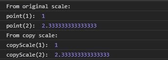
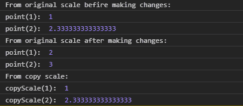

# D3 . js . point . copy()函数

> 原文:[https://www.geeksforgeeks.org/d3-js-point-copy-function/](https://www.geeksforgeeks.org/d3-js-point-copy-function/)

**point.copy()** 函数用于构造并返回当前比例的副本。对任一比例的任何更改都是相互独立的，即拷贝比例的更改不会影响原始比例，反之亦然。

**语法:**

```
point.copy();
```

**参数:**此功能不接受任何参数。

**返回值:**该函数返回当前刻度的副本。返回类型是一个函数。

下面是上面给出的函数的几个例子。

**例 1:**

```
<!DOCTYPE html> 
<html lang = "en"> 
<head> 
    <meta charset = "UTF-8" /> 
    <meta name = "viewport"
        path1tent = "width=device-width, 
        initial-scale = 1.0"/> 
    <title>GeekforGeeks</title> 
    <script src =
    "https://d3js.org/d3.v4.min.js">
    </script>

</head> 
<body> 
    <script> 
// Creating the point scale with specified domain and range.
        var point = d3.scalePoint()
                    .domain([1, 2, 3, 4])
                    .range([1, 5]);
        var copyScale = point.copy();
        console.log("From original scale: ");
        console.log("point(1): ", point(1));
        console.log("point(2): ", point(2));
        console.log("From copy scale: ");
        console.log("copyScale(1): ", copyScale(1));
        console.log("copyScale(2): ", copyScale(2));

    </script> 
</body> 
</html>
```

**输出:**

[](https://media.geeksforgeeks.org/wp-content/uploads/20200821103359/0190.png)

**例 2:**

```
<!DOCTYPE html> 
<html lang = "en"> 
<head> 
    <meta charset = "UTF-8" /> 
    <meta name = "viewport"
        path1tent = "width=device-width, 
        initial-scale = 1.0"/> 
    <title>GeekforGeeks</title> 
    <script src =
    "https://d3js.org/d3.v4.min.js">
    </script>

</head> 
<body> 
    <script> 
// Creating the point scale with specified domain and range.
        var point = d3.scalePoint()
                    .domain([1, 2, 3, 4])
                    .range([1, 5]);

        console.log("From original scale befire making changes: ");
        console.log("point(1): ", point(1));
        console.log("point(2): ", point(2));
        // Making copy of the original scale
        var copyScale = point.copy();
        point.round([1, 5]);
        console.log("From original scale after making changes: ");
        console.log("point(1): ", point(1));
        console.log("point(2): ", point(2));

        console.log("From copy scale: ");
        // Changes in original scale does not
        // Affect copy scale
        console.log("copyScale(1): ", copyScale(1));
        console.log("copyScale(2): ", copyScale(2));

    </script> 
</body> 
</html>
```

**输出:**

[](https://media.geeksforgeeks.org/wp-content/uploads/20200821103702/0191.png)