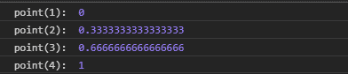
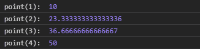

# D3.js 点.域()函数

> 原文:[https://www.geeksforgeeks.org/d3-js-point-domain-function/](https://www.geeksforgeeks.org/d3-js-point-domain-function/)

**point.domain()** 函数用于将点比例的域设置为指定的值数组。数组中的第一个元素映射到范围中的第一个点，域中的第二个值映射到第二个点，依此类推。

**语法:**

```
point.domain([domain]);
```

**参数:**该功能接受以上给出的单个参数，描述如下:

*   **域:**该参数设置点尺度的域，即最小值和最大值。

**返回值:**这个函数不返回任何东西。

下面是上面给出的函数的几个例子。

**例 1:**

```
<!DOCTYPE html> 
<html lang = "en"> 
<head> 
    <meta charset = "UTF-8" /> 
    <meta name = "viewport"
        path1tent = "width=device-width, 
        initial-scale = 1.0"/> 
    <title>GeekforGeeks</title> 
    <script src =
    "https://d3js.org/d3.v4.min.js">
    </script>

</head> 
<style>
</style>
<body> 
    <script> 
    // Creating the point scale with 
   // specified domain and range.
        var point = d3.scalePoint()
                    .domain([1, 2, 3, 4]);

        console.log("point(1): ", point(1));
        console.log("point(2): ", point(2));
        console.log("point(3): ", point(3));
        console.log("point(4): ", point(4));
    </script> 
</body> 
</html>
```

**输出:**



**例 2:**

```
<!DOCTYPE html> 
<html lang = "en"> 
<head> 
    <meta charset = "UTF-8" /> 
    <meta name = "viewport"
        path1tent = "width=device-width, 
        initial-scale = 1.0"/> 
    <title>GeekforGeeks</title> 
    <script src =
    "https://d3js.org/d3.v4.min.js">
    </script>

</head> 
<style>
</style>
<body> 
    <script> 
// Creating the point scale with specified domain and range.
        var point = d3.scalePoint()
                    .domain([1, 2, 3, 4])
                    .range([10, 50]);

        console.log("point(1): ", point(1));
        console.log("point(2): ", point(2));
        console.log("point(3): ", point(3));
        console.log("point(4): ", point(4));
    </script> 
</body> 
</html>
```

**输出:**

