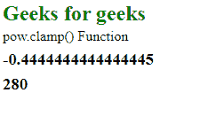
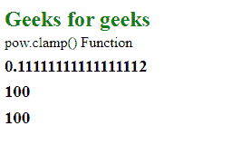

# D3.js 电源箝位()功能

> 原文:[https://www.geeksforgeeks.org/d3-js-pow-clamp-function/](https://www.geeksforgeeks.org/d3-js-pow-clamp-function/)

d3.js 中的 **pow.clamp()** 功能仅在指定了夹钳的情况下用于启用夹钳或禁用夹钳。如果箝位被禁用，返回值的范围可能超出给定范围。

**语法:**

```
pow.clamp(clamp);
```

**属性值:**该函数接受上面给出的和下面描述的单个参数。

*   **箝位:**接受真或假的布尔值。

下面是上面给出的函数的几个例子。

**示例 1:** 当箝位设置为假时。

## 超文本标记语言

```
<!DOCTYPE html>
<html lang="en">
<head>
    <meta charset="UTF-8" />
    <meta name="viewport"
        path1tent="width=device-width,
        initial-scale=1.0"/>
    <script src=
    "https://d3js.org/d3.v4.min.js">
    </script>
    <script src=
    "https://d3js.org/d3-color.v1.min.js">
    </script>
    <script src=
    "https://d3js.org/d3-interpolate.v1.min.js">
    </script>
    <script src=
    "https://d3js.org/d3-scale-chromatic.v1.min.js">
    </script>
</head>
<body>
    <h2 style="color: green;">
        Geeks for geeks
        </h2>

<p>pow.clamp() Function </p>

    <script>
        // Calling the .scalePow() function
        var x = d3.scalePow()
            .domain([10, 100])
            .range([0, 5])        
            .clamp(false);

        // Calling pow() and .invert() function
        var a = x(2);
        var b = x.invert(15);
        document.write("<h3>"+a+"</h3>");
        document.write("<h3>"+b+"</h3>");
    </script>
    </script>
</body>
</html>
```

**输出:**

[](https://media.geeksforgeeks.org/wp-content/uploads/20200818093522/0110.png)

**示例 2:** 当箝位设置为真时。

## 超文本标记语言

```
<!DOCTYPE html>
<html lang="en">
<head>
    <meta charset="UTF-8" />
    <meta name="viewport"
        path1tent="width=device-width,
        initial-scale=1.0"/>
    <script src=
    "https://d3js.org/d3.v4.min.js">
    </script>
    <script src=
    "https://d3js.org/d3-color.v1.min.js">
    </script>
    <script src=
    "https://d3js.org/d3-interpolate.v1.min.js">
    </script>
    <script src=
    "https://d3js.org/d3-scale-chromatic.v1.min.js">
    </script>
</head>
<body>
    <h2 style="color:green;">Geeks for geeks</h2>

<p>pow.clamp() Function </p>

    <script>  
        // Calling the .scalePow() function
        var x = d3.scalePow()
            .domain([10, 100])
            .range([0, 5])         
            .clamp(true);

        // Calling pow() and .invert() function
        var a = x(12);
        var b = x.invert(15);
        var c = x.invert(150);
        document.write("<h3>"+a+"</h3>");
        document.write("<h3>"+b+"</h3>");
        document.write("<h3>"+c+"</h3>");
    </script>
    </script>
</body>
</html>
```

**输出:**

[](https://media.geeksforgeeks.org/wp-content/uploads/20200818093635/0111.png)