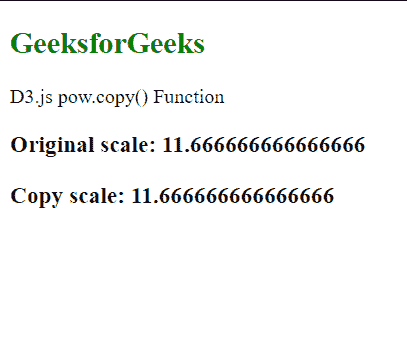
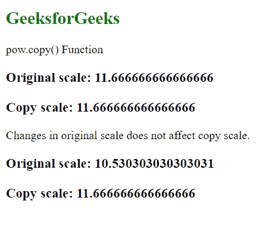

# D3.js pow.copy()功能

> 原文:[https://www.geeksforgeeks.org/d3-js-pow-copy-function/](https://www.geeksforgeeks.org/d3-js-pow-copy-function/)

**pow.copy()** 函数用于创建并返回给定比例的精确副本。原始比例的任何变化都不会影响返回比例，反之亦然。

**语法:**

```
pow.copy();
```

**参数:**此功能不接受任何参数。

**返回值:**该函数返回原始刻度的精确副本。

**例 1:**

## 超文本标记语言

```
<!DOCTYPE html>
<html lang="en">

<head>
    <meta charset="UTF-8" />
    <meta name="viewport" path1tent=
        "width=device-width, initial-scale=1.0" />

    <script src="https://d3js.org/d3.v4.min.js">
    </script>
</head>

<body>
    <h2 style="color: green;">GeeksforGeeks</h2>

    <p>D3.js pow.copy() Function </p>

    <script>
        var pow = d3.scalePow()
            .domain([1, 10])
            .range([10, 20, 30, 40, 50, 60]);

        let powCopy = pow.copy();

        document.write("<h3>Original scale: " 
                + pow(2.5) + "</h3>");

        document.write("<h3>Copy scale: " 
                + powCopy(2.5) + "</h3>");
    </script>
</body>

</html>
```

**输出:**



**例 2:**

## 超文本标记语言

```
<!DOCTYPE html>
<html lang="en">

<head>
    <meta charset="UTF-8" />
    <meta name="viewport" path1tent=
        "width=device-width, initial-scale=1.0" />

    <script src="https://d3js.org/d3.v4.min.js">
    </script>
</head>

<body>
    <h2 style="color: green;">GeeksforGeeks</h2>

    <p>pow.copy() Function </p>

    <script>
        var pow = d3.scalePow()
            .domain([1, 10])
            .range([10, 20, 30, 40, 50, 60]);

        let powCopy = pow.copy();

        document.write("<h3>Original scale: " 
                + pow(2.5) + "</h3>");

        document.write("<h3>Copy scale: " 
                + powCopy(2.5) + "</h3>");

        pow.exponent(2);
        document.write("<p> Changes in original "
            + "scale does not affect copy scale.</p>");

        document.write("<h3>Original scale: "
                    + pow(2.5) + "</h3>");

        document.write("<h3>Copy scale: " 
                    + powCopy(2.5) + "</h3>");
    </script>
</body>

</html>
```

**输出:**

