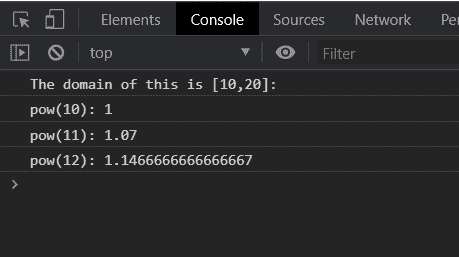
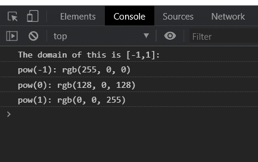

# D3.js pow.domain()函数

> 原文:[https://www.geeksforgeeks.org/d3-js-pow-domain-function/](https://www.geeksforgeeks.org/d3-js-pow-domain-function/)

**pow.domain()** 函数用于将标尺的域设置为指定的数字数组。此处指定的数组必须包含两个或两个以上的元素。

**语法:**

```
pow.domain([domain]);
```

**参数:**该函数采用上面给出并在下面描述的单个参数。

*   **【域】:**取两个或多个指定域的值的数组。

**返回值:** 该函数不返回值。

**例 1:**

## 超文本标记语言

```
<!DOCTYPE html>
<html lang="en">

<head>
    <meta charset="UTF-8" />
    <meta name="viewport" path1tent=
        "width=device-width,initial-scale=1.0"/>
    <script src="https://d3js.org/d3.v4.min.js">
    </script>
</head>

<body>
    <script>
        var pow = d3.scalePow()

            // Setting domain for the scale.
            .domain([10, 20])
            .range(["1", "2", "3", "4", "5"])
            .exponent(2);
        console.log("The domain of this is [10,20]: ");
        console.log("pow(10): " + pow(10));
        console.log("pow(11): " + pow(11));
        console.log("pow(12): " + pow(12));
    </script>
</body>

</html>
```

**输出:**



**例 2:**

## 超文本标记语言

```
<!DOCTYPE html>
<html lang="en">

<head>
    <meta charset="UTF-8" />
    <meta name="viewport" path1tent=
    "width=device-width, initial-scale=1.0" />

    <script src="https://d3js.org/d3.v4.min.js">
    </script>
</head>
<style>
</style>

<body>
    <script>
        var pow = d3.scalePow()
            // Setting domain for the scale.
            .domain([-1, 1])
            .range(["red", "blue", "green", "white"])
            .exponent(2);
        console.log("The domain of this is [-1,1]: ");
        console.log("pow(-1): " + pow(-1));
        console.log("pow(0): " + pow(0));
        console.log("pow(1): " + pow(1));
    </script>
</body>

</html>
```

**输出:**

