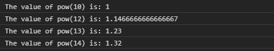
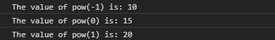

# D3.js 幂指数()函数

> 原文:[https://www.geeksforgeeks.org/d3-js-pow-exponent-function/](https://www.geeksforgeeks.org/d3-js-pow-exponent-function/)

**幂指数()**函数用于指定给定值的指数。当未指定指数时，它返回当前指数。当前指数的值默认为 1。

**语法:**

```
pow.exponent( exponent )

```

**参数:**该函数接受一个参数，如上所述，如下所述。

*   **指数:**该参数接受一个数值，该数值将当前指数设置为给定值。它是一个可选值。

**返回值:**这个函数不返回任何东西。

下面的程序说明了 D3.js 中的**幂指数()**函数:

**例**T2【1:

## 超文本标记语言

```
<!DOCTYPE html>
<html lang="en">
<head>
  <meta charset="UTF-8" />
  <meta name="viewport" 
        content="width=device-width,
                 initial-scale=1.0" />
  <title>GeeksforGeeks</title>
  <script src=
"https://d3js.org/d3.v4.min.js">
  </script>
  <script src=
"https://d3js.org/d3-color.v1.min.js">
  </script>
  <script src=
"https://d3js.org/d3-interpolate.v1.min.js">
  </script>
  <script src=
"https://d3js.org/d3-scale-chromatic.v1.min.js">
  </script>
</head>
<body>
  <script>
    var pow = d3.scalePow()
      .domain([10, 20])
      .range(["1", "2", "3", "4", "5"])
      .exponent(2);

    console.log("The value of pow(10) is: " + pow(10));
    console.log("The value of pow(12) is: " + pow(12));
    console.log("The value of pow(13) is: " + pow(13));
    console.log("The value of pow(14) is: " + pow(14));
  </script>
</body>
</html>
```

**输出:**

[](https://media.geeksforgeeks.org/wp-content/uploads/20200817231343/01.PNG)

**例 2:**

## 超文本标记语言

```
<!DOCTYPE html>
<html lang="en">
<head>
  <meta charset="UTF-8" />
  <meta name="viewport" 
        content="width=device-width,
                 initial-scale=1.0" />
  <title>GeeksforGeeks</title>
  <script src=
"https://d3js.org/d3.v4.min.js">
  </script>
  <script src=
"https://d3js.org/d3-color.v1.min.js">
  </script>
  <script src=
"https://d3js.org/d3-interpolate.v1.min.js">
  </script>
  <script src=
"https://d3js.org/d3-scale-chromatic.v1.min.js">
  </script>
</head>
<body>
  <script>
    var pow = d3.scalePow()
      .domain([-1, 1])
      .range([10, 20, 30, 40, 50])
      .exponent(10);

    console.log("The value of pow(-1) is: " + pow(-1));
    console.log("The value of pow(0) is: " + pow(0));
    console.log("The value of pow(1) is: " + pow(1));
  </script>
</body>
</html>
```

**输出:**

[](https://media.geeksforgeeks.org/wp-content/uploads/20200817232320/015.png)