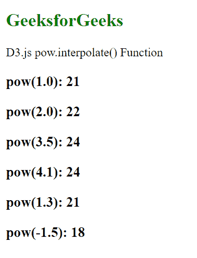

# D3 . js power . INTERPOL()函数

> 原文:[https://www . geesforgeks . org/D3-js-pow-INTERPOL-function/](https://www.geeksforgeeks.org/d3-js-pow-interpolate-function/)

**power . interpole()**功能用于设置范围插值器工厂，该工厂用于为相邻范围的每对值创建插值器。

**语法:**

```
pow.interpolate(interpolate);
```

**参数:**该函数接受一个参数，如上所述，如下所述。

*   **插值器:**该参数接受插值器。

**返回值:**这个函数不返回任何东西。

下面的例子说明了 D3.js 中的 pow.interpolate()函数:

**示例:**下面给出的是上面提到的给定函数的示例。

```
<!DOCTYPE html>
<html lang="en">

<head>
    <meta charset="UTF-8" />
    <meta name="viewport" path1tent=
        "width=device-width,initial-scale=1.0"/>
    <script src="https://d3js.org/d3.v4.min.js">
    </script>
    <script src=
    "https://d3js.org/d3-color.v1.min.js">
    </script>
    <script src=
    "https://d3js.org/d3-interpolate.v1.min.js">
    </script>
    <script src=
    "https://d3js.org/d3-scale-chromatic.v1.min.js">
    </script>
</head>

<body>
    <h2 style="color:green;">
        GeeksforGeeks
    </h2>

    <p>D3.js pow.interpolate() Function</p>

    <script>
        var pow = d3.scalePow()

            // Domain ranges -10, 0, 10
            .domain([-10, 0, 10])

            // Range for the domain
            .range([10, 20, 30, 40, 50, 60, 70, 80, 90])

            // Using interpolateRound
            .interpolate(d3.interpolateRound);

        document.write("<h3>pow(1.0): " + pow(1.0) + "</h3>");
        document.write("<h3>pow(2.0): " + pow(2.0) + "</h3>");
        document.write("<h3>pow(3.5): " + pow(3.5) + "</h3>");
        document.write("<h3>pow(4.1): " + pow(4.1) + "</h3>");
        document.write("<h3>pow(1.3): " + pow(1.3) + "</h3>");
        document.write("<h3>pow(-1.5): " + pow(-2.5) + "</h3>");
    </script>
</body>

</html>
```

**输出:**

