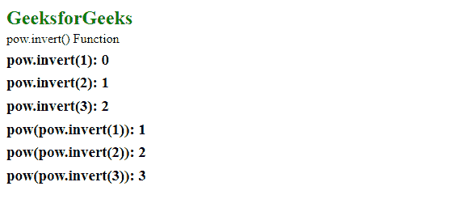
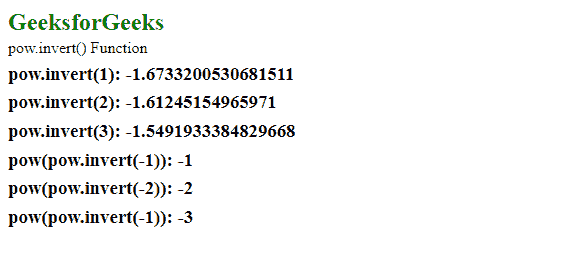

# D3.js 电源逆变()功能

> 原文:[https://www.geeksforgeeks.org/d3-js-pow-invert-function/](https://www.geeksforgeeks.org/d3-js-pow-invert-function/)

当给定范围内的值时，**power . invert()**函数用于从域中返回一个值。这种反转对于交互很有用，例如确定对应于鼠标位置的数据值。

**语法:**

```
pow.invert( value )

```

**参数:**该函数只接受一个参数，如上所述，如下所述:

*   **值:**它是属于给定范围内任意值的数字。

**返回值:**该函数从域中返回一个数字。

下面的程序说明了 D3.js 中的**power . invert()**功能:

**例** **1:** 取范围内所有元素为正。

## 超文本标记语言

```
<!DOCTYPE html>
<html lang="en">
<head>
  <meta charset="UTF-8" />
  <meta name="viewport" 
        content="width=device-width,
                 initial-scale=1.0" />
  <title>GeeksforGeeks</title>
  <script src=
"https://d3js.org/d3.v4.min.js">
  </script>
  <script src=
"https://d3js.org/d3-color.v1.min.js">
  </script>
  <script src=
"https://d3js.org/d3-interpolate.v1.min.js">
  </script>
  <script src=
"https://d3js.org/d3-scale-chromatic.v1.min.js">
  </script>
</head>
<body>
  <h2 style="color: green">GeeksforGeeks</h2>

<p>pow.invert() Function </p>

  <script>
    var pow = d3.scalePow()
      .domain([0, 1])
      .range([1, 2, 3, 4, 5, 6]);

    document.write("<h3> pow.invert(1): " + 
                   pow.invert(1) + "</h3>");
    document.write("<h3>pow.invert(2): " +
                   pow.invert(2) + "</h3>");
    document.write("<h3>pow.invert(3): " + 
                   pow.invert(3) + "</h3>");
    document.write("<h3> pow(pow.invert(1)): " + 
                   pow(pow.invert(1)) + "</h3>");
    document.write("<h3>pow(pow.invert(2)): " +
                   pow(pow.invert(2)) + "</h3>");
    document.write("<h3>pow(pow.invert(3)): " +
                   pow(pow.invert(3)) + "</h3>");
  </script>
</body>
</html>
```

**输出:**



**示例 2:** 取一个范围数组，使其同时包含正数和负数。

## 超文本标记语言

```
<!DOCTYPE html>
<html lang="en">
<head>
  <meta charset="UTF-8" />
  <meta name="viewport" 
        content="width=device-width,
                 initial-scale=1.0" />
  <title>GeeksforGeeks</title>
  <script src=
"https://d3js.org/d3.v4.min.js">
  </script>
  <script src=
"https://d3js.org/d3-color.v1.min.js">
  </script>
  <script src=
"https://d3js.org/d3-interpolate.v1.min.js">
  </script>
  <script src=
"https://d3js.org/d3-scale-chromatic.v1.min.js">
  </script>
</head>
<body>
  <h2 style="color: green">GeeksforGeeks</h2>

<p>pow.invert() Function </p>

  <script>
    var pow = d3.scalePow()
      .domain([-1, 1])
      .rangeRound([10, 20, 30, 40, 50, 60])
      .exponent(2);

    document.write("<h3> pow.invert(1): " +
                   pow.invert(1) + "</h3>");
    document.write("<h3>pow.invert(2): " +
                   pow.invert(2) + "</h3>");
    document.write("<h3>pow.invert(3): " + 
                   pow.invert(3) + "</h3>");
    document.write("<h3> pow(pow.invert(-1)): " +
                   pow(pow.invert(-1)) + "</h3>");
    document.write("<h3>pow(pow.invert(-2)): " +
                   pow(pow.invert(-2)) + "</h3>");
    document.write("<h3>pow(pow.invert(-1)): " + 
                   pow(pow.invert(-3)) + "</h3>");
  </script>
</body>
</html>
```

**输出:**

