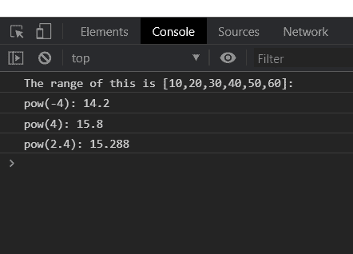
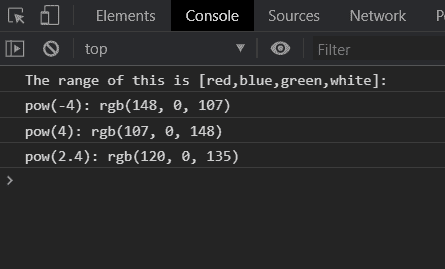

# D3.js 功率范围()功能

> 原文:[https://www.geeksforgeeks.org/d3-js-pow-range-function/](https://www.geeksforgeeks.org/d3-js-pow-range-function/)

d3.js 中的 **pow.range()** 函数用于将标尺的范围设置为指定的值数组，该数组必须包含两个或两个以上的值。范围内的元素可以是数字或字符串。

**语法:**

```
pow.range([range]);

```

**参数:**该函数采用上面给出并在下面描述的单个参数。

*   **【范围】:**这是一个包含指定域范围的数组。

**返回值:** 该函数不返回值。

**例 1:**

## 超文本标记语言

```
<!DOCTYPE html>
<html lang="en">

<head>
    <meta charset="UTF-8" />
    <meta name="viewport" path1tent=
        "width=device-width,initial-scale=1.0" />

    <script src="https://d3js.org/d3.v4.min.js">
    </script>
</head>

<body>
    <script>
        var pow = d3.scalePow()

            // Setting domain for the scale.
            .domain([-10, 10])

            // Range of numbers
            .range([10, 20, 30, 40, 50, 60])
            .exponent(2);
        console.log("The range of this is "
                + "[10,20,30,40,50,60]: ");
        console.log("pow(-4): " + pow(-4));
        console.log("pow(4): " + pow(4));
        console.log("pow(2.4): " + pow(2.4));
    </script>
</body>

</html>
```

**输出:**



**例 2:**

## 超文本标记语言

```
<!DOCTYPE html>
<html lang="en">

<head>
    <meta charset="UTF-8" />
    <meta name="viewport" path1tent=
        "width=device-width,initial-scale=1.0" />

    <script src="https://d3js.org/d3.v4.min.js">
    </script>
</head>

<body>
    <script>
        var pow = d3.scalePow()

            // Setting domain for the scale.
            .domain([-10, 10])

            // Range of colors
            .range(["red", "blue", "green", "white"])
            .exponent(2);
        console.log("The range of this is"
            + " [red,blue,green,white]: ");
        console.log("pow(-4): " + pow(-4));
        console.log("pow(4): " + pow(4));
        console.log("pow(2.4): " + pow(2.4));
    </script>
</body>

</html>
```

**输出:**

