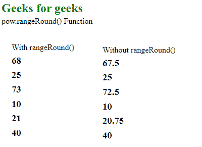
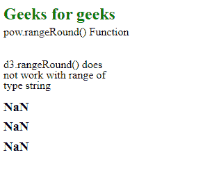

# D3.js pow.rangeRound()功能

> 原文:[https://www . geesforgeks . org/D3-js-pow-range round-function/](https://www.geeksforgeeks.org/d3-js-pow-rangeround-function/)

**pow.rangeRound()** 函数用于将刻度范围设置为指定的值数组，同时在内部将插值器设置为插值或环绕。

**语法:**

```
pow.rangeRound([range]);
```

**参数:**该函数采用上面给出并在下面描述的单个参数。

*   **【范围】:**这是一个包含指定域范围的数组。

**返回值:**这个函数不返回任何东西。

下面是上面给出的函数的几个例子。

**示例 1:** 当范围数组中的元素是类型号时。

```
<!DOCTYPE html> 
<html lang="en"> 
<head> 
    <meta charset="UTF-8" /> 
    <meta name="viewport"
        path1tent="width=device-width, 
        initial-scale=1.0"/> 
    <script src=
    "https://d3js.org/d3.v4.min.js">
    </script> 
    <script src=
    "https://d3js.org/d3-color.v1.min.js">
    </script> 
    <script src=
    "https://d3js.org/d3-interpolate.v1.min.js">
    </script> 
    <script src=
    "https://d3js.org/d3-scale-chromatic.v1.min.js">
    </script> 
</head> 
<body> 
    <h2 style="color: green;">
        Geeks for geeks</h2>
    <p>pow.rangeRound() Function </p>
    <script> 
        var pow = d3.scalePow()
                    // Domain ranges -1, +1
                        .domain([-1, +1])
                    // Range for the domain
.rangeRound([10, 20, 30, 40, 50, 60, 70, 80, 90]);

        document.write("<br/><div>");
        document.write("<p>With rangeRound()");
        document.write("<h3>"+pow(10.5)+"</h3>");
        document.write("<h3>"+pow(2)+"</h3>");
        document.write("<h3>"+pow(11.5)+"</h3>");
        document.write("<h3>"+pow(-1)+"</h3>");
        document.write("<h3>"+pow(1.15)+"</h3>");
        document.write("<h3>"+pow(5)+"</h3></div>");

        var pow = d3.scaleLinear()
                    // Domain ranges -1, +1
                        .domain([-1, +1])
                    // Range for the domain
.range([10, 20, 30, 40, 50, 60, 70, 80, 90])

        document.write("<br/><div>");
        document.write("<p>Without rangeRound()");
        document.write("<h3>"+pow(10.5)+"</h3>");
        document.write("<h3>"+pow(2)+"</h3>");
        document.write("<h3>"+pow(11.5)+"</h3>");
        document.write("<h3>"+pow(-1)+"</h3>");
        document.write("<h3>"+pow(1.15)+"</h3>");
        document.write("<h3>"+pow(5)+"</h3></div>");
    </script> 
</body> 
</html>
```

**输出:**

[](https://media.geeksforgeeks.org/wp-content/uploads/20200818091800/017.png)

**示例 2:** 当范围数组中的元素类型为字符串时。

```
<!DOCTYPE html> 
<html lang="en"> 
<head> 
    <meta charset="UTF-8" /> 
    <meta name="viewport"
        path1tent="width=device-width, 
        initial-scale=1.0"/> 
    <script src=
    "https://d3js.org/d3.v4.min.js">
    </script> 
    <script src=
    "https://d3js.org/d3-color.v1.min.js">
    </script> 
    <script src=
    "https://d3js.org/d3-interpolate.v1.min.js">
    </script> 
    <script src=
    "https://d3js.org/d3-scale-chromatic.v1.min.js">
    </script> 
</head> 
<body> 
    <h2 style="color: green;">Geeks for geeks</h2>
    <p>pow.rangeRound() Function </p>
    <script> 
        var pow = d3.scalePow()
                    // Domain ranges -1, +1
                        .domain([-1, +1])
                    // Range for the domain
.rangeRound(["green", "blue", "red", "black", "white"]);

        document.write("<br/><div>");
        document.write(
"<p>d3.rangeRound() does not work with range of type string");
        document.write("<h3>"+pow(10.5)+"</h3>");
        document.write("<h3>"+pow(2)+"</h3>");
        document.write("<h3>"+pow(11.5)+"</h3>");
    </script> 
</body> 
</html>
```

**输出:**

[](https://media.geeksforgeeks.org/wp-content/uploads/20200818092054/018.png)