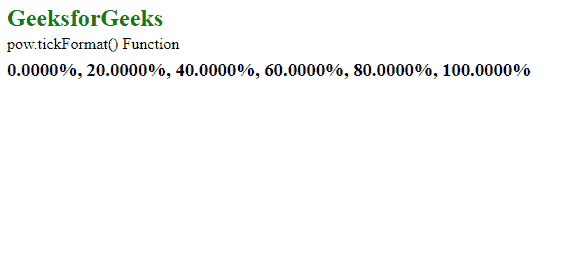

# D3.js pow.tickFormat()函数

> 原文:[https://www . geesforgeks . org/D3-js-pow-tick format-function/](https://www.geeksforgeeks.org/d3-js-pow-tickformat-function/)

**pow.tickFormat()** 功能用于更改刻度值的格式。它返回一个适合显示刻度值的数字格式函数。

**语法:**

```
pow.tickFormat( count, specifier )

```

**参数:**该函数接受两个参数，如上所述，如下所述。

*   **计数:**是要使用的刻度值的数量。这是一个可选参数。
*   **说明符:**是指定要使用的格式的字符串。这是一个可选参数。

**返回值:**这个函数不返回任何东西。

下面的程序说明了 D3.js 中的 **pow.tickFormat()** 函数:

**例 1:**

## 超文本标记语言

```
<!DOCTYPE html>
<html lang="en">
<head>
  <meta charset="UTF-8" />
  <meta name="viewport"
        content="width=device-width,
                 initial-scale=1.0" />
  <title>GeeksforGeeks</title>
  <script src=
"https://d3js.org/d3.v4.min.js">
  </script>
  <script src=
"https://d3js.org/d3-color.v1.min.js">
  </script>
  <script src=
"https://d3js.org/d3-interpolate.v1.min.js">
  </script>
  <script src=
"https://d3js.org/d3-scale-chromatic.v1.min.js">
  </script>
</head>
<body>
  <h2 style="color: green">GeeksforGeeks</h2>

<p>pow.tickFormat() Function </p>

  <script>
    var x = d3.scalePow()
      .domain([0, 1])
      .range([1, 2, 3, 4, 5, 6])
      .exponent(0.5);

    var ticks = x.ticks(5)
    var tickFormat = x.tickFormat(100000, " %");

    document.write("<h3>" + 
        ticks.map(tickFormat) + "</h3>");
  </script>
</body>
</html>
```

**输出:**



**例 2:**

## 超文本标记语言

```
<!DOCTYPE html>
<html lang="en">
<head>
  <meta charset="UTF-8" />
  <meta name="viewport" 
        content="width=device-width,
                 initial-scale=1.0" />
  <title>GeeksforGeeks</title>
  <script src=
"https://d3js.org/d3.v4.min.js">
  </script>
  <script src=
"https://d3js.org/d3-color.v1.min.js">
  </script>
  <script src=
"https://d3js.org/d3-interpolate.v1.min.js">
  </script>
  <script src=
"https://d3js.org/d3-scale-chromatic.v1.min.js">
  </script>
</head>
<body>
  <h2 style="color: green">GeeksforGeeks</h2>

<p>pow.tickFormat() Function </p>

  <script>
    var x = d3.scalePow()
      .domain([1, 10])
      .range([10, 20, 30, 40, 50, 60])
      .exponent(2);

    var ticks = x.ticks(5)
    var tickFormat = x.tickFormat(10, " {content}quot;);

    document.write("<h3>" + 
        ticks.map(tickFormat) + "</h3>");
  </script>
</body>
</html>
```

**输出:**

