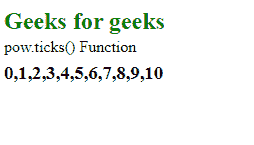
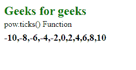

# D3.js pow.ticks()函数

> 原文:[https://www.geeksforgeeks.org/d3-js-pow-ticks-function/](https://www.geeksforgeeks.org/d3-js-pow-ticks-function/)

**pow.ticks()** 函数用于从秤的区域返回计数值。ticks()返回的值位于域中。如果计数不是作为参数给出的，那么默认情况下它被设置为 10。

**语法:**

```
pow.ticks([count]);
```

**参数:**该函数接受一个参数，如上所述，如下所述。

*   **计数:**是给定域中等距值的数量。

**返回值:**这个函数不返回任何东西。

下面是上面给出的函数的几个例子。

**例 1:**

```
<!DOCTYPE html> 
<html lang="en"> 
<head> 
    <meta charset="UTF-8" /> 
    <meta name="viewport"
        path1tent="width=device-width, 
        initial-scale=1.0"/> 
    <script src=
    "https://d3js.org/d3.v4.min.js">
    </script> 
    <script src=
    "https://d3js.org/d3-color.v1.min.js">
    </script> 
    <script src=
    "https://d3js.org/d3-interpolate.v1.min.js">
    </script> 
    <script src=
    "https://d3js.org/d3-scale-chromatic.v1.min.js">
    </script> 
</head> 
<body> 
    <h2 style="color: green;">Geeks for geeks</h2>
    <p>pow.ticks() Function </p>
    <script> 
        var pow = d3.scalePow()
            .domain([0, 10])
            .range([0, 10])
            .ticks(8)
        document.write("<h3>"+pow+"</h3>")
    </script> 
</body> 
</html>
```

**输出:**

[](https://media.geeksforgeeks.org/wp-content/uploads/20200818095648/0113.png)

**例 2:**

```
<!DOCTYPE html> 
<html lang="en"> 
<head> 
    <meta charset="UTF-8" /> 
    <meta name="viewport"
        path1tent="width=device-width, 
        initial-scale=1.0"/> 
    <script src=
    "https://d3js.org/d3.v4.min.js">
    </script> 
    <script src=
    "https://d3js.org/d3-color.v1.min.js">
    </script> 
    <script src=
    "https://d3js.org/d3-interpolate.v1.min.js">
    </script> 
    <script src=
    "https://d3js.org/d3-scale-chromatic.v1.min.js">
    </script> 
</head> 
<body> 
    <h2 style="color: green;">
         Geeks for geeks
    </h2>
    <p>pow.ticks() Function </p>
    <script> 
        var pow = d3.scalePow()
            .domain([-10, 10])
            .range([0, 10])
            .ticks(12)
        document.write("<h3>"+pow+"</h3>")
    </script> 
</body> 
</html>
```

**输出:**

[](https://media.geeksforgeeks.org/wp-content/uploads/20200818095748/0114.png)