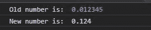
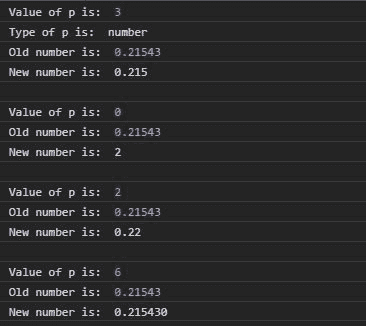

# D3.js 精度固定()功能

> 原文:[https://www . geesforgeks . org/D3-js-precision fixed-function/](https://www.geeksforgeeks.org/d3-js-precisionfixed-function/)

[D3.js](https://www.geeksforgeeks.org/d3-js-data-driven-documents/) 中的 **d3.precisionFixed()** 函数用于根据给定的步长值返回定点浮点记数法的小数精度。

**语法:**

```
d3.precisionFixed(step);
```

**参数:**只取一个上面给定，下面描述的参数。

*   **步长:**步长值表示小数点后需要多少位，例如，0.1 表示输出中小数点后一位，0.001 表示小数点后三位。

**返回值:**返回一个数字。

下面给出了上述函数的几个例子。

**例 1:**

```
<!DOCTYPE html>
<html lang="en">
<head>
  <meta charset="UTF-8">
  <meta name="viewport" 
        content="width=device-width, 
                 initial-scale=1.0">
  <title>Document</title>
</head>
<style>
</style>
<body>
  <!--Fetching from CDN of D3.js -->
  <script type = "text/javascript"
          src = "https://d3js.org/d3.v4.min.js">
  </script>
  <script>
    let p=d3.precisionFixed(0.001);
    let f=d3.format("."+p+"f");
    let roundedNumber=f(.12359);
    console.log("Old number is: ", 0.012345);
    console.log("New number is: ", roundedNumber);
  </script>
</body>
</html>
```

**输出:**



**例 2:**

```
<!DOCTYPE html>
<html lang="en">
<head>
  <meta charset="UTF-8">
  <meta name="viewport" 
        content="width=device-width,
                 initial-scale=1.0">
  <title>Document</title>
</head>
<style>
</style>
<body>
  <!--Fetching from CDN of D3.js -->
  <script type = "text/javascript"
          src = "https://d3js.org/d3.v4.min.js">
  </script>
  <script>
    let p=d3.precisionFixed(0.005);
    let f=d3.format("."+p+"f");
    let roundedNumber=f(.21543);
    // Number of digits after decimal
    console.log("Value of p is: ", p);
    console.log("Type of p is: ", typeof p)
    console.log("Old number is: ", 0.21543);
    console.log("New number is: ", roundedNumber);

    console.log("\n");
    p=d3.precisionFixed(1);
    f=d3.format("."+p+"f");
    roundedNumber=f(2.21543);
    // Number of digits after decimal
    console.log("Value of p is: ", p);
    console.log("Old number is: ", 0.21543);
    console.log("New number is: ", roundedNumber);

    console.log("\n");
    p=d3.precisionFixed(0.01);
    f=d3.format("."+p+"f");
    roundedNumber=f(.21543);
    // Number of digits after decimal
    console.log("Value of p is: ", p);
    console.log("Old number is: ", 0.21543);
    console.log("New number is: ", roundedNumber);

    console.log("\n");
    p=d3.precisionFixed(0.000002);
    f=d3.format("."+p+"f");
    roundedNumber=f(.21543);
    // Number of digits after decimal
    console.log("Value of p is: ", p);
    console.log("Old number is: ", 0.21543);
    console.log("New number is: ", roundedNumber);
  </script>
</body>
</html>
```

**输出:**

