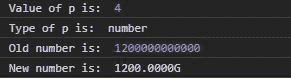
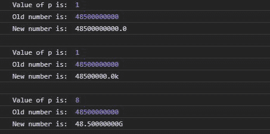

# D3.js precisionPrefix()函数

> 原文:[https://www . geesforgeks . org/D3-js-precision prefix-function/](https://www.geeksforgeeks.org/d3-js-precisionprefix-function/)

[D3.js](https://www.geeksforgeeks.org/d3-js-data-driven-documents/) 的 **precisionPrefix()** 函数用于返回指定的精度，然后与 locale.formatPrefix 一起使用。

**语法:**

```
d3.precisionPrefix(step, value);
```

**参数:**取上面给定和下面描述的两个参数。

*   **步骤:**它告诉需要格式化的值之间的最小差异。
*   **值:**这里的值告诉我们给定的数字要使用什么样的 SI 前缀，例如 M 代表百万，G 代表千兆。

**返回:**返回数字。

下面给出了上述函数的几个例子。

**例 1:** 这里 p 是 4，表示小数点后有 4 位数字。

```
<!DOCTYPE html>
<html lang="en">
<head>
  <meta charset="UTF-8">
  <meta name="viewport" 
        content="width=device-width, 
                 initial-scale=1.0">
  <title>Document</title>
</head>
<style>
</style>
<body>
  <!--Fetching from CDN of D3.js -->
  <script type = "text/javascript" 
          src = "https://d3js.org/d3.v4.min.js">
   </script>
  <script>
    // Here p is 4 that means for digits after decimal
    var p = d3.precisionPrefix(1e5, 1.2e10);
    let f = d3.formatPrefix("." + p, 1.2e10);
    let roundedNumber=f( 1.2e12);
    // Number of digits after decimal
    console.log("Value of p is: ", p);
    console.log("Type of p is: ", typeof p)
    // Old number is 
    console.log("Old number is: ", 1.2e12);
    // Number after the use of the precisionprefix
    console.log("New number is: ", roundedNumber);
  </script>
</body>
</html>
```

**输出:**



**例 2:**

```
<!DOCTYPE html>
<html lang="en">
<head>
  <meta charset="UTF-8">
  <meta name="viewport"
        content="width=device-width, 
                 initial-scale=1.0">
  <title>Document</title>
</head>
<style>
</style>
<body>
  <!--Fetching from CDN of D3.js -->
  <script type = "text/javascript"
          src = "https://d3js.org/d3.v4.min.js">
   </script>
  <script>
    var p = d3.precisionPrefix(1e2, 4.1e4);
    var f = d3.formatPrefix("." + p, 4.e1);
    var newNumber=f(4.85e10);
    // Number of digits after decimal
    console.log("Value of p is: ", p);
    // Old number is 
    console.log("Old number is: ", 4.85e10);
    // Number after the use of the precisionprefix
    console.log("New number is: ", newNumber);
    console.log("\n");

    var p = d3.precisionPrefix(1e2, 4.1e4);
    var f = d3.formatPrefix("." + p, 4.e5);
    var newNumber=f(4.85e10);
    // Number of digits after decimal
    console.log("Value of p is: ", p);
    // Old number is 
    console.log("Old number is: ", 4.85e10);
    // Number after the use of the precisionprefix
    console.log("New number is: ", newNumber);
    console.log("\n");

    var p = d3.precisionPrefix(1e4, 4.1e14);
    var f = d3.formatPrefix("." + p, 4.e10);
    var newNumber=f(4.85e10);
    // Number of digits after decimal
    console.log("Value of p is: ", p);
    // Old number is 
    console.log("Old number is: ", 4.85e10);
    // Number after the use of the precisionprefix
    console.log("New number is: ", newNumber);
    console.log("\n");
  </script>
</body>
</html>
```

**输出:**

