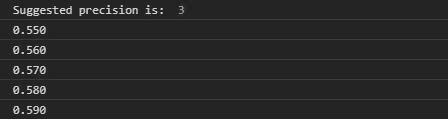

# D3.js precisionRound()函数

> 原文:[https://www . geesforgeks . org/D3-js-precision round-function/](https://www.geeksforgeeks.org/d3-js-precisionround-function/)

D3.js 的 **precisionRound()** 函数用于计算四舍五入表示法中小数点后的有效数字。它需要两个参数步长和最大值。

**语法:**

```
d3.precisionRound(step, max);

```

**参数:**取上述两个参数，描述如下:

*   **步骤:**告知需要格式化的两个值之间的最小绝对差。
*   **Max:** 表示需要格式化的最大绝对值。

**返回:**返回数字。

**例 1:**

## 超文本标记语言

```
<!DOCTYPE html>
<html lang="en">

<head>
    <meta charset="UTF-8">
    <meta name="viewport" content=
        "width=device-width, initial-scale=1.0">
</head>

<body>
    <!-- Fetching from CDN of D3.js -->
    <script type="text/javascript" 
        src="https://d3js.org/d3.v4.min.js">
    </script>

    <script>
        var p = d3.precisionRound(0.5, 1.5);

        // For .5, 1.0, 1.5 the step should
        // be 0.5 And the max should be 1.5
        // so suggested precision is 2
        console.log("Suggested precision is: ", p)
        var f = d3.format("." + p + "r");
        console.log(f(.5));
        console.log(f(1.0));
        console.log(f(1.5));
    </script>
</body>

</html>
```

**输出:**


**例 2:**

## 超文本标记语言

```
<!DOCTYPE html>
<html lang="en">

<head>
    <meta charset="UTF-8">
    <meta name="viewport" content=
        "width=device-width, initial-scale=1.0">
</head>

<body>
    <!-- Fetching from CDN of D3.js -->
    <script type="text/javascript" 
        src="https://d3js.org/d3.v4.min.js">
    </script>

    <script>
        var p = d3.precisionRound(0.01, 1.01);

        // For .55, .56,... the step should
        // be 0.01 And the max should be 1.01
        // so suggested precision is 3
        console.log("Suggested precision is: ", p)
        var f = d3.format("." + p + "r");
        console.log(f(.55));
        console.log(f(0.56));
        console.log(f(0.57));
        console.log(f(.58));
        console.log(f(.59));
    </script>
</body>

</html>
```

**输出:**

