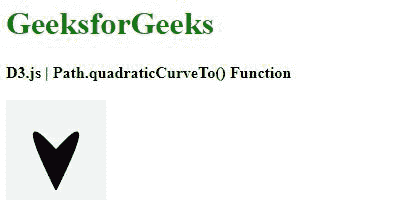
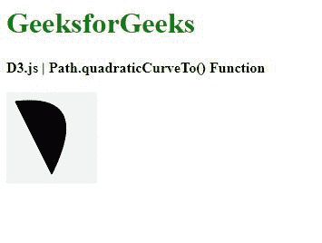

# D3 . js Quadraticcerveto()函数

> 原文:[https://www . geeksforgeeks . org/D3-js-quadraticucerveto-function/](https://www.geeksforgeeks.org/d3-js-quadraticcurveto-function/)

**D3 . path . Quadraticcerveto()**函数用于通过某些控制点，将二次贝塞尔曲线段从当前点绘制到某一点。

**语法:**

```
path.quadraticCurveTo(cpx, cpy, x, y)

```

**参数:**取上面给定，下面描述的四个参数。

*   **cpx:** 是二次控制点的 x 坐标。
*   **cpy:** 是二次控制点的 y 坐标。
*   **x:** 是终点的 x 坐标。
*   **y:** 是终点的 y 坐标。

**例 1:**

## 超文本标记语言

```
<!DOCTYPE html>
<html lang="en">

<head>
    <meta charset="UTF-8">
    <meta name="viewport" path1tent=
        "width=device-width,initial-scale=1.0">

    <script src=
        "https://d3js.org/d3.v4.min.js">
    </script>

    <style>
        h1 {
            color: green;
        }

        svg {
            background-color: #f2f2f2;
        }

        .path2 {
            stroke: #000;
        }
    </style>
</head>

<body>
    <div>
        <h1>GeeksforGeeks</h1>
        <b>D3.js | Path.quadraticCurveTo() Function</b>
        <br><br>

        <svg width="100" height="100">
            <path class="path2">
        </svg>
    </div>

    <script>

        // Creating a path 
        var path = d3.path();
        path.moveTo(50, 50);
        path.quadraticCurveTo(95, 0, 50, 90)

        // Closing the path 
        path.closePath();
        path.quadraticCurveTo(5, 0, 50, 90)

        // Closing the path 
        path.closePath();
        d3.select(".path2").attr("d", path); 
    </script>
</body>

</html>
```

**输出:**



**例 2:**

## 超文本标记语言

```
<!DOCTYPE html>
<html lang="en">

<head>
    <meta charset="UTF-8">
    <meta name="viewport" path1tent=
        "width=device-width,initial-scale=1.0">

    <script src=
        "https://d3js.org/d3.v4.min.js">
    </script>

    <style>
        h1 {
            color: green;
        }

        svg {
            background-color: #f2f2f2;
        }

        .path2 {
            stroke: #000;
        }
    </style>
</head>

<body>
    <div>
        <h1>GeeksforGeeks</h1>
        <b>D3.js | Path.quadraticCurveTo() Function</b>
        <br><br>
        <svg width="100" height="100">
            <path class="path2">
        </svg>
    </div>

    <script>;

        // Creating a path 
        var path = d3.path();
        path.moveTo(10, 10);
        path.quadraticCurveTo(95, 0, 50, 90)

        // Closing the path 
        path.closePath();
        d3.select(".path2").attr("d", path); 
    </script>
</body>

</html>
```

**输出:**

