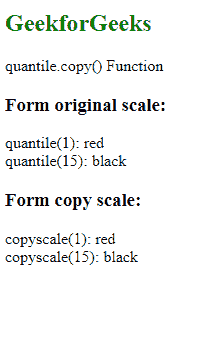
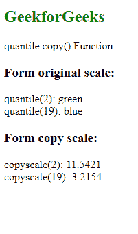

# D3.js 分位数. copy()函数

> 原文:[https://www.geeksforgeeks.org/d3-js-quantile-copy-function/](https://www.geeksforgeeks.org/d3-js-quantile-copy-function/)

**分位数. copy()** 函数返回原始刻度的精确副本。任何一个刻度的变化都不会影响另一个刻度。

**语法:**

```
quantile.copy();
```

**参数:**此功能不接受任何参数。

**返回值:**该函数返回原始刻度的副本。

下面的例子说明了 D3.js 中的分位数. copy()函数:

**例 1:**

## 超文本标记语言

```
<!DOCTYPE html>
<html lang="en">

<head>
    <meta charset="UTF-8" />
    <meta name="viewport" path1tent=
        "width=device-width, initial-scale=1.0"/>

    <script src="https://d3js.org/d3.v4.min.js">
    </script>
</head>

<body>
    <h2 style="color:green;">GeekforGeeks</h2>

    <p>quantile.copy() Function</p>

    <script>
        var quantile = d3.scaleQuantile()
            // Setting domain for the scale.
            .domain([1, 2, 15, 19])
            // Discrete range
            .range(["red", "green", "black", "blue"]);
        // Printing the output.
        document.write("<h3>Form original scale: </h3>");

        document.write("<span>quantile(1): " 
                + quantile(1) + "</span><br>");
        document.write("<span>quantile(15): " 
                + quantile(15) + "</span><br>");
        document.write("<h3>Form copy scale: </h3>");
        var copyscale = quantile.copy();
        document.write("<span>copyscale(1): " 
                + copyscale(1) + "</span><br>");
        document.write("<span>copyscale(15): "
                + copyscale(15) + "</span><br>");
    </script>
</body>

</html>
```

**输出:**

[](https://media.geeksforgeeks.org/wp-content/uploads/20200822194130/01114.png)

**例 2:**

## 超文本标记语言

```
<!DOCTYPE html>
<html lang="en">

<head>
    <meta charset="UTF-8" />
    <meta name="viewport" path1tent=
        "width=device-width, initial-scale=1.0"/>

    <script src="https://d3js.org/d3.v4.min.js">
    </script>
</head>

<body>
    <h2 style="color: green;">GeekforGeeks</h2>

    <p>quantile.copy() Function </p>

    <script>
        var quantile = d3.scaleQuantile()
            // Setting domain for the scale.
            .domain([1, 2, 15, 19])
            // Discrete range
            .range(["red", "green", "black", "blue"]);

        // Printing the output.
        document.write("<h3>Form original scale: </h3>");
        document.write("<span>quantile(2): " 
                + quantile(2) + "</span><br>");
        document.write("<span>quantile(19): " 
                + quantile(19) + "</span><br>");
        document.write("<h3>Form copy scale: </h3>");
        // Changing th copy scale. 
        var copyscale = quantile.copy()
            .range([1.22, 11.5421, 2.2154, 3.2154]);
        document.write("<span>copyscale(2): " 
                + copyscale(2) + "</span><br>");
        document.write("<span>copyscale(19): " 
                + copyscale(19) + "</span><br>");
    </script>
</body>

</html>
```

**输出:**

[](https://media.geeksforgeeks.org/wp-content/uploads/20200822194315/01115.png)