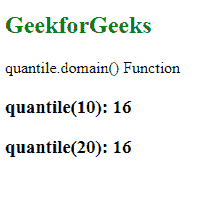

# D3.js 分位数.域()函数

> 原文:[https://www . geesforgeks . org/D3-js-分位数-域-函数/](https://www.geeksforgeeks.org/d3-js-quantile-domain-function/)

**分位数域()**功能用于设置分位数标度的域。给定的域数组不能为空，并且必须包含至少一个数值。

**语法:**

```
quantile.domain([domain]);

```

**参数:**该函数只取一个参数，如上所述，如下所述。

*   **域:**该参数设置标度的域，即最小值和最大值。它接受离散数值的数组。数组必须包含至少一个数值。

**返回值:**该函数不返回值。

下面的例子说明了 D3.js 中的分位数. domain()函数:

**例 1:**

## 超文本标记语言

```
<!DOCTYPE html>
<html lang="en">

<head>
    <meta charset="UTF-8" />
    <meta name="viewport" path1tent=
        "width=device-width,initial-scale=1.0" />

    <script src="https://d3js.org/d3.v4.min.js">
    </script>
</head>

<body>
    <h2 style="color: green;">GeekforGeeks</h2>

    <p>quantile.domain() Function</p>

    <script>
        var quantile = d3.scaleQuantile()
            // Setting domain for the scale
            .domain([1000])
            // Setting the range of the scale
            .range([16]);

        // Printing the output
        document.write("<h3>quantile(10): " 
                + quantile(10) + "</h3>");
        document.write("<h3>quantile(20): " 
                + quantile(20) + "</h3>");
    </script>
</body>

</html>
```

**输出:**

[](https://media.geeksforgeeks.org/wp-content/uploads/20200822195015/01118.png)

**例 2:**

## 超文本标记语言

```
<!DOCTYPE html>
<html lang="en">

<head>
    <meta charset="UTF-8" />
    <meta name="viewport" path1tent=
        "width=device-width, initial-scale=1.0" />

    <script src="https://d3js.org/d3.v4.min.js">
    </script>
</head>

<body>
    <h2 style="color: green;">GeekforGeeks</h2>

    <p>quantile.domain() Function</p>

    <script>
        var quantile = d3.scaleQuantile()
            // Setting domain for the scale
            .domain([1, 2, 3, 4])
            // Setting the range of the scale
            .range([6, 16, 24, 28]);

        // Printing the output
        document.write("<h3>quantile(1): "
                + quantile(1) + "</h3>");
        document.write("<h3>quantile(2): " 
                + quantile(2) + "</h3>");
        document.write("<h3>quantile(3): " 
                + quantile(3) + "</h3>");
        document.write("<h3>quantile(4): " 
                + quantile(4) + "</h3>");
    </script>
</body>

</html>
```

**输出:**

[](https://media.geeksforgeeks.org/wp-content/uploads/20200822195233/01119.png)