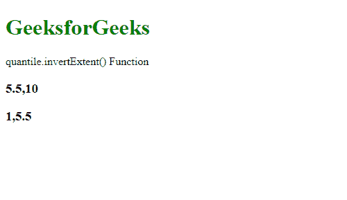
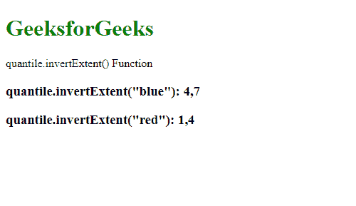

# D3.js 分位数.反转范围()函数

> 原文:[https://www . geesforgeks . org/D3-js-分位数-反转范围-函数/](https://www.geeksforgeeks.org/d3-js-quantile-invertextent-function/)

**d3.js** 中的**分位数.反转范围()**函数用于返回范围中相应值在指定域中的范围。

**语法:**

```
quantile.invertExtent( value )
```

**参数:**该函数接受一个参数，如上所述，如下所述:

*   **值:**是对应指定范围的值。

**返回值:**这个函数从指定的域中返回一个值。

下面的程序说明了 D3.js 中的**分位数.反转范围()**函数:

**例 1:**

## 超文本标记语言

```
<!DOCTYPE html>
<html>

<head>
    <script src="https://d3js.org/d3.v4.min.js">
    </script>
    <script src=
        "https://d3js.org/d3-color.v1.min.js">
    </script>
    <script src=
    "https://d3js.org/d3-interpolate.v1.min.js">
    </script>
    <script src=
    "https://d3js.org/d3-scale-chromatic.v1.min.js">
    </script>
</head>

<body>
    <h1 style="color: green;">
        GeeksforGeeks
    </h1>

    <p>quantile.invertExtent() Function </p>

    <script>
        var quantile = d3.scaleQuantile()
            // Setting domain for the scale.
            .domain([1, 10])
            // Setting the range of the scale.
            .range([0, 960]);

        // Printing the output
        document.write("<h3>" +
            quantile.invertExtent(960) +
            "</h3>");
        document.write("<h3>" +
            quantile.invertExtent(0) +
            "</h3>");
    </script>
</body>

</html>
```

**输出:**



**例 2:**

## 超文本标记语言

```
<!DOCTYPE html>
<html>

<head>
    <script src="https://d3js.org/d3.v4.min.js">
    </script>
    <script src=
        "https://d3js.org/d3-color.v1.min.js">
    </script>
    <script src=
    "https://d3js.org/d3-interpolate.v1.min.js">
    </script>
    <script src=
    "https://d3js.org/d3-scale-chromatic.v1.min.js">
    </script>
</head>

<body>
    <h1 style="color: green;">
        GeeksforGeeks
    </h1>

    <p>quantile.invertExtent() Function </p>

    <script>
        var quantile = d3.scaleQuantile()
            // Setting domain for the scale.
            .domain([1, 10])
            // Setting the range of the scale.
            .range(["red", "blue", "orange"]);

        // Printing the output
        document.write(
            "<h3>quantile.invertExtent(\"blue\"): " +
            quantile.invertExtent("blue") + "</h3>");
        document.write(
            "<h3>quantile.invertExtent(\"red\"): " +
            quantile.invertExtent("red") + "</h3>");
    </script>
</body>

</html>
```

**输出:**

