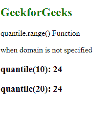
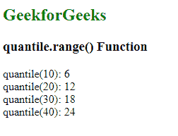

# D3.js 分位数.范围()函数

> 原文:[https://www . geesforgeks . org/D3-js-分位数-范围-函数/](https://www.geeksforgeeks.org/d3-js-quantile-range-function/)

**分位数范围()**功能用于设置分位数范围。范围数组中的值的数量决定了该函数创建的分位数。

**语法:**

```
quantile.range([range]);
```

**参数:**该功能接受单个参数，如上所述，如下所述。

*   **范围:**该参数接受离散值数组。

**返回值:**该函数不返回值。

下面的例子说明了 D3.js 中的分位数. range()函数:

**例 1:**

## 超文本标记语言

```
<!DOCTYPE html>
<html lang="en">

<head>
    <meta charset="UTF-8" />
    <meta name="viewport" path1tent=
        "width=device-width, initial-scale=1.0"/>

    <script src="https://d3js.org/d3.v4.min.js">
    </script>
</head>

<body>
    <h2 style="color:green">GeekforGeeks</h2>

    <p>quantile.range() Function</p>

    <script>
        var quantile = d3.scaleQuantile()
            .range([6, 12, 18, 24]);

        // Printing the output
        document.write("when domain is not specified")
        document.write("<h3>quantile(10): " 
                + quantile(10) + "</h3>");
        document.write("<h3>quantile(20): " 
                + quantile(20) + "</h3>");
    </script>
</body>

</html>
```

**输出:**

[](https://media.geeksforgeeks.org/wp-content/uploads/20200822193726/01112.png)

**例 2:**

## 超文本标记语言

```
<!DOCTYPE html>
<html lang="en">

<head>
    <meta charset="UTF-8" />
    <meta name="viewport" path1tent=
        "width=device-width, initial-scale=1.0"/>

    <script src="https://d3js.org/d3.v4.min.js">
    </script>
</head>

<body>
    <h2 style="color:green">GeekforGeeks</h2>
    <h3>quantile.range() Function</h3>
    <script>
        var quantile = d3.scaleQuantile()
            // Setting domain for the scale.
            .domain([10, 20, 30, 40])
            // Discrete range
            .range([6, 12, 18, 24]);

        // Printing the output
        document.write("<span>quantile(10): " 
            + quantile(10) + "</span><br>");
        document.write("<span>quantile(20): " 
            + quantile(20) + "</span><br>");
        document.write("<span>quantile(30): " 
            + quantile(30) + "</span><br>");
        document.write("<span>quantile(40): " 
            + quantile(40) + "</span><br>");
    </script>
</body>

</html>
```

**输出:**

[](https://media.geeksforgeeks.org/wp-content/uploads/20200822193920/01113.png)